# 
COURSE PROJECT

    <strong>Universidad Peruana de Ciencias Aplicadas</strong> 
     
    <strong>Ingeniería de Software</strong> 
    <strong>Arquitecturas De Software Emergentes - 7318</strong> 
    <strong>Profesor: Royer Edelwer Rojas Malasquez </strong> 
     <strong>INFORME</strong>

<h4 align="center"><strong>Startup: Nexora</strong></h4>

<h4 align="center"><strong>Product: </strong></h4>

  <h5> Team Members</h5>

  <table>
    <thead>
      <tr>
        <th>Member</th>
        <th>Code</th>
      </tr>
    </thead>
    <tbody>
      <tr>
        <td>Aguilar Castillo, Rodrigo</td>
        <td>U202210584</td>
      </tr>
      <tr>
        <td>Luna Capuñay, Italo</td>
        <td>U202212760</td>
      </tr>
      <tr>
        <td>Landeo Simeón, Favio</td>
        <td>u202119588</td>
      </tr>
      <tr>
        <td>Mallma Espiritu, Franky</td>
        <td>u20211c250</td>
      </tr>
      <tr>
        <td>Tongo Alejandro, Milagros Salet</td>
        <td>U202116078</td>
      </tr>
      <tr>
        <td>Silva Morales, Renzo</td>
        <td>U20221C362</td>
      </tr>
    </tbody>
  </table>

# Registro de Versiones del Informe

<!-- ToDo -->
falta tabla de registro de versiones

# Contenido
<!-- ToDo -->
falta completar tabla de contenido

[Registro de Versiones del Informe](#registro-de-versiones-del-informe)

[Project Report Collaboration Insights](#project-report-collaboration-insights)

[Student Outcome](#student-outcome)

[Capítulo I: Introducción](#capítulo-i-introducción)

[1.1 Startup Profile](#11-startup-profile)  
[1.1.1. Descripción de la Startup](#111-descripción-de-la-startup)  
[1.1.2. Perfiles de integrantes del equipo](#112-perfiles-de-integrantes-del-equipo)

[1.2. Solution Profile](#12-solution-profile)  
[1.2.1 Antecedentes y problemática](#121-antecedentes-y-problemática)  
[1.2.2 Lean UX Process.](#122-lean-ux-process)  
[1.2.2.1. Lean UX Problem Statements.](#1221-lean-ux-problem-statements)  
[1.2.2.2. Lean UX Assumptions.](#1222-lean-ux-assumptions)  
[1.2.2.3. Lean UX Hypothesis Statements.](#1223-lean-ux-hypothesis-statements)  
[1.2.2.4. Lean UX Canvas.](#1224-lean-ux-canvas)

[1.3. Segmentos objetivo.](#13-segmentos-objetivo)

[Capítulo II: Requirements Elicitation & Analysis](#capítulo-ii-requirements-elicitation--analysis)

[2.1. Competidores](#21-competidores)  
[2.1.1. Análisis competitivo](#211-análisis-competitivo)  
[2.1.2. Estrategias y tácticas frente a competidores](#212-estrategias-y-tácticas-frente-a-competidores)

[2.2. Entrevistas](#22-entrevistas)  
[2.2.1. Diseño de entrevistas](#221-diseño-de-entrevistas)    
[2.2.3. Análisis de entrevistas](#223-análisis-de-entrevistas)

[2.3. Needfinding](#23-needfinding)  
[2.3.1. User Personas](#231-user-personas)  
[2.3.2. User Task Matrix](#232-user-task-matrix)  
[2.3.3. User Journey Mapping](#233-user-journey-mapping)  
[2.3.4. Empathy Mapping](#234-empathy-mapping)  
[2.3.5. As-is Scenario Mapping](#235-as-is-scenario-mapping)

[2.4. Ubiquitous Language](#24-ubiquitous-language)

[Capítulo III: Requirements Specifications](#capítulo-iii-requirements-specification)

[3.1. To-Be Scenario Mapping](#31-to-be-scenario-mapping)

[3.2. User Stories](#32-user-stories)

[3.3. Impact Mapping](#33-impact-mapping)

[3.4. Product Backlog](#34-product-backlog)

[Capítulo IV: Solution Software Design](#capítulo-iv-solution-software-design)

# Capítulo I: Introducción

## 1.1. Startup Profile

### 1.1.1. Descripción de la Startup

  
Nexora es una empresa emergente que se distingue por su enfoque innovador en la integración de inteligencia artificial y tecnologías digitales para transformar la manera en que profesionales y empresas comparten información, oportunidades y conocimiento. Fundada con el propósito de crear un espacio digital abierto a múltiples industrias, Nexora ha logrado posicionarse como un actor en crecimiento gracias a su capacidad para combinar la generación automática de contenido con funcionalidades sociales que fomentan la colaboración.  

  

  
Nuestra empresa se caracteriza por su compromiso con la innovación, la tecnología y la creación de comunidades profesionales más conectadas. En Nexora creemos firmemente en el poder de la inteligencia artificial para mejorar el acceso a información de calidad. Por ello, ofrecemos soluciones que permiten recopilar y resumir noticias, generar títulos atractivos y crear contenido visual dinámico, mientras facilitamos la interacción directa entre profesionales, empresas y proveedores.  

  

  
Como empresa emergente, apostamos por un crecimiento sostenible y por la expansión de nuestro alcance a nivel nacional e internacional. Nos enorgullece ser parte de la revolución digital en la gestión y el consumo de información, y estamos entusiasmados por seguir desarrollando herramientas que impulsen una colaboración más justa, eficiente y transparente mediante nuestra tecnología basada en IA.  

  

#### **Visión**  

  
La visión de Nexora es consolidarse como la plataforma de referencia en el uso de inteligencia artificial aplicada al acceso, resumen y distribución de información profesional, creando un ecosistema global donde múltiples industrias puedan conectar, colaborar y crecer de manera conjunta.  

  

#### **Misión**  

  
La misión de Nexora es desarrollar y ofrecer una plataforma digital que integre inteligencia artificial y funcionalidades sociales, facilitando que profesionales y empresas puedan compartir contenido, acceder a información de calidad y establecer conexiones de valor en un entorno transparente, dinámico y especializado.  

  

### 1.1.2. Perfiles de los integrantes

<table>
  <thead>
    <tr>
      <th>Nombre</th>
      <th>Descripción</th>
      <th>Foto</th>
    </tr>
  </thead>
  <tbody>
    <tr>
      <td>Rodrigo Aguilar Castillo</td>
      <td>
        Soy Rodrigo, estudiante de Ingeniería de Software en la Universidad Peruana de Ciencias Aplicadas (UPC). Me apasiona la tecnología y los dispositivos electrónicos, y disfruto especialmente programar, lo cual se ha convertido en uno de mis principales pasatiempos. 
        Siempre estoy buscando aprender nuevas herramientas y mejorar mis habilidades en el desarrollo de software.  
        <strong>Habilidades Técnicas</strong> 
        - Desarrollo Frontend con <strong>Angular</strong> y <strong>Vue</strong> 
        - Desarrollo Backend con <strong>Java</strong> y <strong>Spring Boot</strong> 
        - Conocimientos en <strong>C++</strong> 
        - Manejo intermedio de <strong>SQL</strong>
      </td>
      <td></td>
    </tr>
    <tr>
      <td>Italo Luna Capuñay</td>
      <td>
        Soy Italo, estudiante de Ingeniería de Software con perfil Full Stack. Tengo experiencia en desarrollo tanto frontend como backend, lo que me permite abordar proyectos de manera integral y aportar soluciones eficientes.  
        <strong>Habilidades Técnicas</strong> 
        - Desarrollo Frontend: Vue.js, Angular, Flutter, Tailwind CSS 
        - Desarrollo Backend: Node.js, Spring Boot, Ruby on Rails, Python, C++ 
        - Bases de datos: SQL y NoSQL 
        - Control de versiones y colaboración: Git 
        </td>
      <td></td>
    </tr>
    <tr>
      <td>Favio Landeo Simeón</td>
      <td>
        Tengo 22 años y actualmente estoy cursando el décimo ciclo de la carrera de Ingeniería de Software. Estoy disponible para ayudar siempre a mis compañeros y además tiendo a generar buenas relaciones sociales con diferentes tipos de personas gracias a mi tolerancia y capacidad de trabajo en equipo. En mis tiempos libres me gusta escuchar música, jugar videojuegos y editar videos.
      </td>
      <td></td>
    </tr>
    <tr>
      <td>Mallma Espiritu Franky</td>
      <td>
        Soy estudiante de Ingeniería de Software, actualmente en el octavo ciclo. Tengo principales conocimientos en <strong>Backend</strong> con <strong>Golang</strong> y <strong>NestJS</strong>, y en <strong>Mobile</strong> con <strong>Flutter</strong>. 
        A nivel de equipo, me considero una persona comprometida y un buscador de soluciones emergentes en los proyectos.  
        <strong>Habilidades Técnicas</strong> 
        - Desarrollo Backend con <strong>Golang</strong> y <strong>NestJS</strong> 
        - Desarrollo Mobile con <strong>Flutter</strong> 
        - Experiencia trabajando con <strong>microservicios</strong> 
        - Manejo de <strong>NATS</strong> y arquitecturas distribuidas
      </td>
      <td></td>
    </tr>
    <tr>
      <td>Renzo Silva Morales</td>
      <td>
        Soy estudiante de Ingeniería de Software, tengo 20 años y me encuentro en el octavo ciclo de la carrera. 
        Me considero un estudiante atento y responsable con los trabajos. Me comprometo a ayudar al equipo en el proyecto.  
        <strong>Habilidades Técnicas</strong> 
        - Desarrollo Frontend con <strong>Angular</strong> y <strong>Vue</strong> 
        - Desarrollo Mobile con <strong>Kotlin</strong> 
        - Manejo intermedio de <strong>SQL</strong>
      </td>
      <td></td>
    </tr>
  </tbody>
</table>

## 1.2. Solution Profile

Nexora nace como respuesta a la necesidad de contar con un espacio digital que permita a profesionales y empresas acceder, compartir y gestionar información de manera más eficiente. A través de una plataforma impulsada por inteligencia artificial, integra herramientas que facilitan la creación de contenido, la curación automatizada de noticias y la interacción social en un mismo entorno.

Gracias al uso de web scraping, procesamiento de lenguaje natural y generación automática de resúmenes, títulos e imágenes, la solución ofrece información clara, actualizada y dinámica. Su interfaz intuitiva y funciones sociales como perfiles, publicaciones, “likes”, comentarios y contacto directo entre usuarios y empresas convierten a Nexora en un ecosistema especializado que optimiza la forma en que las comunidades profesionales se informan, colaboran y generan oportunidades de crecimiento.

### 1.2.1. Antecedentes y problemática

En la actualidad, los profesionales y las empresas enfrentan un entorno marcado por la sobrecarga informativa, entendida como la situación en la que la cantidad o intensidad de información excede la capacidad limitada del individuo para el procesamiento cognitivo. Este fenómeno se traduce en síntomas como trabajo ineficiente, confusión, demora en la toma de decisiones, ansiedad y estrés (Parra-Medina & Álvarez-Cervera, 2021).

En sectores como la minería y la tecnología, donde la innovación avanza rápidamente y el acceso a información actualizada es esencial para la competitividad, esta problemática se intensifica. Noticias, cursos, ofertas laborales y eventos se encuentran dispersos en múltiples plataformas, lo que fragmenta la experiencia de los usuarios y limita las oportunidades de colaboración y aprendizaje.

A pesar de la existencia de redes sociales profesionales como LinkedIn, persisten carencias estructurales que no atienden las necesidades de nichos específicos, lo que abre espacio para soluciones más enfocadas y especializadas.

#### Principales problemáticas identificadas:

- **Sobrecarga de información irrelevante:** gran parte del contenido en redes profesionales es genérico y poco filtrado.  
- **Falta de curación automatizada:** no existen mecanismos basados en IA que organicen, resuman o presenten noticias de forma clara y concisa.  
- **Escasa especialización sectorial:** los profesionales de industrias clave como minería o tecnología deben recurrir a fuentes dispersas.  
- **Tiempo perdido en búsqueda de información:** la falta de automatización obliga a los usuarios a invertir horas revisando múltiples medios.  
- **Limitaciones en la interacción directa:** muchas plataformas priorizan el networking básico, sin generar espacios de colaboración profunda entre empresas y profesionales.  

Esta situación evidencia la necesidad de contar con una plataforma que unifique la **curación de contenido con inteligencia artificial** y la **interacción social**, para optimizar la forma en que se accede, se comparte y se aprovecha la información en comunidades profesionales.

Nexora surge como una respuesta integral a la problemática de la sobrecarga y fragmentación de información en entornos profesionales. Nuestra plataforma combina el poder de la inteligencia artificial con funcionalidades sociales para crear un ecosistema digital eficiente, transparente y colaborativo.  

Mediante el uso de web scraping y procesamiento de lenguaje natural, Nexora recopila información relevante del sector, la resume en textos claros y la presenta con títulos generados automáticamente e imágenes dinámicas. Esto permite a los usuarios acceder a contenido actualizado sin necesidad de navegar por múltiples fuentes.  

Con Nexora, se optimiza el acceso a información de calidad, se ahorra tiempo en procesos de búsqueda y se fomenta una colaboración más efectiva entre comunidades profesionales. De esta manera, Nexora no solo responde a una necesidad actual, sino que impulsa la transformación digital en la gestión de conocimiento y conexiones de valor.  

#### Técnica de las 5W's y 2H's

##### ¿What? - ¿Cuál es el problema?  
Falta de acceso rápido y organizado a información relevante y confiable en sectores profesionales como minería y tecnología, lo que impide que usuarios y empresas tomen decisiones informadas y aprovechen oportunidades de networking y aprendizaje.  

##### ¿Who? - ¿Quiénes son los beneficiarios?  
Profesionales, empresas y proveedores de servicios en industrias como minería, tecnología y otros sectores donde la información especializada y actualizada es crítica.  

##### ¿When? - ¿Cuándo se origina el problema?  
El problema surge de forma constante, debido a la gran cantidad de noticias, eventos, cursos y publicaciones que se generan diariamente, dispersos en múltiples plataformas y sin filtrado especializado.  

##### ¿Why? - ¿Por qué se origina el problema?  
Se origina por la abundancia de contenido digital y la falta de herramientas que filtren, resuman y presenten información relevante de manera clara, rápida y confiable.  

##### ¿Where? - ¿Dónde ocurre el problema?  
Ocurre en entornos digitales profesionales globales, especialmente en sectores donde la actualización constante es crítica, como minería y tecnología, y donde los usuarios dependen de múltiples fuentes dispersas.  

##### ¿How? - ¿Cómo se origina el problema?  
Se origina por la ausencia de plataformas especializadas que integren curación automática de contenido mediante IA, resúmenes claros, generación de títulos e imágenes, y funciones sociales para interacción directa entre usuarios y empresas.  

##### ¿How much? - ¿Cuánto dinero está implicado?  
Los costos de pérdida de productividad y tiempo debido a la sobrecarga de información son difíciles de cuantificar, pero estudios indican que la gestión ineficiente de datos puede representar hasta 20% de tiempo perdido en procesos de información y toma de decisiones en empresas medianas y grandes. La plataforma Nexora ofrece diferentes planes de suscripción según el tamaño de la empresa y el nivel de acceso a funciones premium de IA.  

### 1.2.2 Lean UX Process

El proceso Lean UX aborda la visión del modelo de negocio que respalda nuestro proyecto, siendo el producto principal nuestra plataforma digital Nexora. A lo largo de este documento se exploran elementos clave del proceso, incluyendo Problem Statements, Assumptions y Hypothesis Statements.

#### 1.2.2.1 Lean UX Problem Statements

En entornos profesionales como minería y tecnología, los usuarios enfrentan una **sobrecarga de información** que dificulta identificar contenido relevante y actualizado. La dispersión de noticias, cursos, eventos y oportunidades en múltiples plataformas limita la capacidad de tomar decisiones informadas y generar conexiones valiosas.

Los profesionales y empresas pierden tiempo revisando múltiples fuentes y carecen de herramientas que automaticen la curación, resumen y presentación de la información. Esto genera frustración, baja productividad y menor aprovechamiento de oportunidades de networking y aprendizaje.

¿Cómo podemos implementar una plataforma digital con IA que centralice, filtre y resuma información relevante, al tiempo que facilite la interacción directa entre profesionales y empresas?

#### 1.2.2.2 Lean UX Assumptions

En esta sección se presentan los **Assumptions** sobre los Features y Outcomes que esperamos con nuestra solución.

**Features:**

- **Curación de Contenido Automatizada:** IA que recopila noticias, eventos y cursos relevantes del sector y los resume en textos claros y títulos generados automáticamente.  
- **Generación de Contenido Visual:** Creación de imágenes y gráficos asociados a cada resumen o noticia para mejorar la comprensión y el engagement.  
- **Dashboard Centralizado:** Plataforma web y móvil donde los usuarios visualizan contenido filtrado según sus intereses y sector.  
- **Interacción Social:** Funciones de “like”, comentarios, seguimiento de usuarios y contacto directo con empresas y proveedores.  
- **Alertas y Notificaciones Personalizadas:** Informes diarios o semanales sobre nuevas oportunidades, noticias o eventos según preferencias del usuario.

**Business Outcomes:**

- **Acquisition (Base): [3,000 visitantes]**  
  Profesionales y empresas descubren la plataforma mediante campañas digitales, alianzas con asociaciones sectoriales, webinars y contenido educativo. Se espera captar inicialmente a 3,000 usuarios interesados en gestión de información profesional y networking.  

- **Activation (Plateau): [900 usuarios : 30%]**  
  De los visitantes, el 30% se registra y comienza a interactuar con la plataforma, configurando preferencias, siguiendo a otros usuarios y explorando contenidos relevantes.  

- **Retention (Plateau + 1 level): [540 usuarios : 60%]**  
  Tras la activación, se espera que el 60% de los usuarios continúe usando la plataforma de manera regular, accediendo a contenidos, notificándose de nuevas oportunidades y participando en interacciones sociales. Esto valida la utilidad y relevancia del producto.  

- **Revenue (Plateau + 2 levels): [80 usuarios : ~15%]**  
  Un 15% de los usuarios adopta planes premium, que incluyen alertas avanzadas, generación personalizada de contenido y análisis de tendencias, dispuestos a pagar por funcionalidades que optimicen su productividad y toma de decisiones.  

- **Referral (Top): [27 usuarios : 5% del total inicial]**  
  Un 5% de los usuarios recomendará Nexora a colegas, empresas y asociaciones del sector, amplificando el alcance de manera orgánica y fortaleciendo la posición de la plataforma como referencia en información profesional y networking digital.  

## Users 

<table>
  <thead>
    <tr>
      <th>Demográfica / Rol</th>
      <th>Comportamiento</th>
      <th>Necesidades / Obstáculos</th>
    </tr>
  </thead>
  <tbody>
    <tr>
      <td><strong>Administrador de la plataforma</strong></td>
      <td>- Gestiona la publicación y curación de contenido, supervisa interacciones</td>
      <td>- Requiere paneles de control claros para moderar contenido, métricas y gestión de usuarios</td>
    </tr>
    <tr>
      <td><strong>Profesional del sector minero</strong></td>
      <td>- Consulta noticias, cursos, eventos y ofertas laborales del sector</td>
      <td>- Quiere acceso rápido a información confiable y especializada</td>
    </tr>
    <tr>
      <td><strong>Profesional del sector tecnológico</strong></td>
      <td>- Sigue tendencias, cursos, herramientas y publicaciones técnicas</td>
      <td>- Necesita filtrar contenido según su especialidad y recibir resúmenes claros</td>
    </tr>
    <tr>
      <td><strong>Proveedor de servicios especializados</strong></td>
      <td>- Ofrece cursos, consultorías, certificaciones o eventos en minería/tecnología</td>
      <td>- Busca un canal directo para llegar a audiencias segmentadas y medir impacto</td>
    </tr>
    <tr>
      <td><strong>Empresa del sector</strong></td>
      <td>- Publica vacantes, difunde proyectos y busca talento</td>
      <td>- Necesita visibilidad en una comunidad especializada y mecanismos eficientes de conexión</td>
    </tr>
  </tbody>
</table>

## User Outcomes & Benefits
En esta sección nos centramos en empatizar con los usuarios de la plataforma Nexora, entendiendo sus necesidades emocionales y profesionales.  

Los profesionales del sector minero y tecnológico buscan acceder a información relevante, actualizada y confiable, así como conectarse con otros profesionales y empresas para generar oportunidades de crecimiento. Desean sentirse informados, empoderados y confiados, sabiendo que pueden filtrar la información dispersa y recibir resúmenes claros sin perder tiempo revisando múltiples fuentes.  

Nuestra plataforma Nexora les permite lograr estos objetivos al ofrecerles contenido curado automáticamente mediante IA, títulos y resúmenes claros, imágenes asociadas a la información y herramientas de interacción social. Como resultado, los usuarios consultan la plataforma con mayor frecuencia, participan activamente en discusiones y networking, responden rápidamente a oportunidades de empleo o capacitación y optimizan la gestión de su conocimiento profesional, evidenciando que han alcanzado sus metas.

---

### Solutions

A partir de los problemas detectados en el análisis de usuarios y la sobrecarga informativa, proponemos las siguientes soluciones tecnológicas:  

- **Curación automática de contenido**  
  **Problema:** Los usuarios enfrentan exceso de información dispersa y poco relevante.  
  **Solución:** IA que filtra y resume noticias, cursos, eventos y publicaciones del sector.  
  **Resultado:** Acceso rápido a información confiable, ahorrando tiempo y esfuerzo en la búsqueda de contenido útil.  

- **Generación de títulos e imágenes dinámicas**  
  **Problema:** La información técnica o extensa es difícil de interpretar de un vistazo.  
  **Solución:** IA que genera títulos claros y contenido visual asociado a cada resumen.  
  **Resultado:** Mejora la comprensión rápida, aumenta el engagement y facilita la difusión del contenido.  

- **Dashboard centralizado y personalizable**  
  **Problema:** Los profesionales deben navegar en múltiples plataformas para obtener información.  
  **Solución:** Panel único que organiza contenido filtrado según intereses, sector y preferencias del usuario.  
  **Resultado:** Mayor transparencia y control sobre el flujo de información relevante.  

- **Alertas y notificaciones personalizadas**  
  **Problema:** Los usuarios pueden perder oportunidades importantes si no se enteran a tiempo.  
  **Solución:** Notificaciones automáticas sobre noticias, cursos, eventos y ofertas de empleo relevantes.  
  **Resultado:** Respuesta rápida ante oportunidades, mejorando la toma de decisiones y la participación en la comunidad.  

- **Interacción social y networking profesional**  
  **Problema:** Falta de herramientas para conectar directamente con otros profesionales o empresas del sector.  
  **Solución:** Funciones de “like”, comentarios, seguimiento y contacto directo con empresas o usuarios.  
  **Resultado:** Facilita la colaboración, fortalece la red profesional y genera oportunidades de negocio o aprendizaje.

**Business Assumptions**

Estos son los puntos que podemos asumir sobre nuestro negocio:

1. Existe una necesidad urgente de acceder a información profesional confiable y filtrada en sectores como minería y tecnología.  
2. Esta necesidad puede resolverse con una plataforma digital que integre IA para curación de contenido, resúmenes automáticos y generación de títulos e imágenes.  
3. El valor principal que buscan los usuarios es ahorrar tiempo y obtener información relevante de forma rápida, mejorando su toma de decisiones y networking profesional.  
4. Nuestros clientes potenciales serán principalmente profesionales, empresas y proveedores que requieren mantenerse actualizados y conectados con su sector.  
5. Obtendremos ingresos a través de un modelo mixto: suscripción a la plataforma con acceso básico gratuito, planes premium con alertas personalizadas, generación de contenido avanzado y análisis de tendencias sectoriales.  
6. Aunque existen plataformas profesionales generalistas (ej. LinkedIn), muchas no ofrecen curación automatizada de contenido sectorial ni integración de IA para optimizar la experiencia. Nuestra ventaja está en la especialización, personalización y herramientas de interacción directa.  
7. El mayor riesgo es la baja adopción inicial por desconocimiento de la plataforma o resistencia al cambio digital.  

8. Planeamos mitigar este riesgo mediante campañas educativas, webinars, demostraciones prácticas y alianzas con asociaciones profesionales que promuevan la adopción de la plataforma.  

#### 1.2.2.3 Lean UX Hypothesis Statements  

### Hipótesis del Proyecto

- **Hipótesis 1**  
  Lograremos posicionarnos como referentes en información profesional y networking digital, con un impacto esperado del 80 % en reconocimiento de marca,  
  si los profesionales del sector reciben contenido relevante y resumido automáticamente mediante IA, con títulos claros e imágenes asociadas.

- **Hipótesis 2**  
  Mejoraremos la eficiencia en la búsqueda de información, con un incremento estimado del 60 % en rapidez de acceso a contenido,  
  si los usuarios pueden acceder a dashboards personalizados que filtren noticias, cursos, eventos y empleos según su sector e intereses.

- **Hipótesis 3**  
  Incrementaremos la participación y colaboración en la plataforma, con un aumento proyectado del 50 % en interacciones (likes, comentarios, seguimientos),  
  si los usuarios cuentan con herramientas sociales integradas para comentar, dar “like”, seguir y contactar directamente a empresas o colegas.

- **Hipótesis 4**  
  Reduciremos el tiempo perdido en búsqueda de información, estimando una reducción del 40 % en tiempo promedio de búsqueda,  
  si las notificaciones automáticas alertan sobre oportunidades relevantes como eventos, cursos o noticias críticas del sector.

- **Hipótesis 5**  
  Aumentaremos la confianza y satisfacción de los usuarios, con un crecimiento esperado del 70 % en percepción de confiabilidad y rapidez de decisión,  
  si tienen acceso a reportes y resúmenes claros que les permitan tomar decisiones informadas de manera rápida.

- **Hipótesis 6**  
  Podremos monetizar la plataforma efectivamente, estimando un 30 % de conversión a planes premium,  
  si ofrecemos funcionalidades avanzadas como análisis de tendencias, alertas personalizadas y generación de contenido especializado.

- **Hipótesis 7**  
  Ampliaremos la adopción de Nexora a distintos sectores y regiones, con un incremento potencial del 65 % en usuarios activos multirregión,  
  si la plataforma es adaptable a diversos niveles de experiencia tecnológica y accesible desde web y dispositivos móviles.

### Lean UX Canvas

<table>
  <thead>
    <tr>
      <th>Sección</th>
      <th>Contenido</th>
    </tr>
  </thead>
  <tbody>
    <tr>
      <td><strong>1. Business Problem</strong></td>
      <td>Profesionales y empresas enfrentan sobrecarga de información en sectores como minería y tecnología. El volumen de noticias, cursos, eventos y empleos crece rápidamente y está disperso en múltiples plataformas, dificultando la identificación de contenido relevante y confiable, así como la generación de conexiones valiosas.</td>
    </tr>
    <tr>
      <td><strong>2. Business Outcomes</strong></td>
      <td>- Posicionamiento de Nexora como plataforma de referencia en información profesional y networking. - Aumento del 40% en eficiencia de búsqueda y consumo de información. - Incremento del 25% en participación y networking entre usuarios. - Reducción del tiempo perdido en búsqueda de información. - Mayor confianza y satisfacción de los usuarios.</td>
    </tr>
    <tr>
      <td><strong>3. Users</strong></td>
      <td>- <strong>Administradores de la plataforma:</strong> gestionan la publicación y curación de contenido, supervisan interacciones. - <strong>Profesionales del sector minero:</strong> consultan noticias, eventos y empleos específicos. - <strong>Profesionales del sector tecnológico:</strong> siguen tendencias, herramientas y publicaciones técnicas relevantes.</td>
    </tr>
    <tr>
      <td><strong>4. User Outcomes & Benefits</strong></td>
      <td>- Acceso rápido a información confiable y resumida mediante IA. - Mejora en la toma de decisiones profesionales. - Participación activa en la comunidad y networking efectivo. - Reducción del tiempo invertido en búsqueda de información. - Empoderamiento profesional al contar con contenido visual y claro. - Mayor confianza en la plataforma como fuente de información especializada.</td>
    </tr>
    <tr>
      <td><strong>5. Solutions</strong></td>
      <td>- <strong>Curación Automática de Contenido:</strong> IA que filtra y resume noticias, cursos y eventos. - <strong>Generación de Títulos e Imágenes:</strong> creación automática de contenido visual y resúmenes claros. - <strong>Dashboard Centralizado y Personalizable:</strong> visualización de contenido filtrado según sector e intereses. - <strong>Interacción Social:</strong> funciones de “like”, comentarios, seguimiento y contacto directo entre usuarios y empresas.</td>
    </tr>
    <tr>
      <td><strong>6. Hypotheses</strong></td>
      <td>- Creemos que Nexora será referente si los usuarios reciben contenido relevante resumido mediante IA. - Creemos que aumentará la eficiencia profesional si los dashboards están personalizados según intereses. - Creemos que se incrementará la participación si existen funciones de interacción social integradas. - Creemos que aumentará la confianza y satisfacción si los reportes y resúmenes son claros y precisos. - Creemos que se monetizará efectivamente si los planes premium ofrecen análisis avanzado.</td>
    </tr>
    <tr>
      <td><strong>7. What's the Most Important Thing We Need to Learn First?</strong></td>
      <td>- Los usuarios comprenden y valoran los dashboards personalizados como herramienta útil. - La curación y resumen de contenido mediante IA ahorra tiempo efectivamente. - La interacción social fomenta networking y colaboración entre profesionales.</td>
    </tr>
    <tr>
      <td><strong>8. What's the Least Amount of Work We Need to Do to Learn the Next Most Important Thing?</strong></td>
      <td>- <strong>Encuestas rápidas:</strong> a profesionales y empresas para validar relevancia de contenido. - <strong>Pruebas de concepto:</strong> piloto con dashboards y resúmenes automáticos de IA. - <strong>Análisis de factibilidad técnica:</strong> validar integración de dashboards. - <strong>Recolección de feedback:</strong> iterar con base en la experiencia de usuarios y engagement en la plataforma.</td>
    </tr>
  </tbody>
</table>

## 1.3 Segmentos objetivo 

<table>
  <thead>
    <tr>
      <th>Variables</th>
      <th>Segmento 1 - Profesionales Minero/Tecnológico</th>
      <th>Segmento 2 - Administradores de la Plataforma</th>
    </tr>
  </thead>
  <tbody>
    <tr>
      <td>Geográfica</td>
      <td>Profesionales ubicados en empresas, consultoras, startups o instituciones relacionadas con minería y tecnología, en zonas urbanas o con acceso digital constante.</td>
      <td>Equipo interno de Nexora responsable de gestionar contenidos, moderar interacciones y mantener la plataforma funcional para todos los usuarios.</td>
    </tr>
    <tr>
      <td>Demográfica</td>
      <td>Personas adultas con formación técnica o universitaria en sus respectivos sectores, interesadas en mantenerse actualizadas, aprender y establecer contactos profesionales.</td>
      <td>Profesionales con experiencia en gestión de plataformas digitales, curación de contenido y atención al usuario, generalmente en edad adulta y con habilidades técnicas o administrativas.</td>
    </tr>
    <tr>
      <td>Psicológica</td>
      <td>Buscan eficiencia, información confiable, oportunidades de networking y desarrollo profesional. Valoran la innovación tecnológica y la posibilidad de interactuar con colegas y empresas del sector.</td>
      <td>Enfoque orientado a mantener la plataforma organizada, ofrecer contenido relevante y asegurar una experiencia de usuario positiva. Valoran la automatización y herramientas que optimicen su trabajo de gestión y curación.</td>
    </tr>
  </tbody>
</table>

# Capítulo IV: Strategic-Level Software Design

## 4.1. Strategic-Level Attribute-Driven Design.
En esta sección se presenta el proceso de diseño arquitectónico centrado en los atributos de calidad previamente identificados para la solución propuesta. Estos atributos buscan asegurar aspectos clave de la aplicación, como transparencia, seguridad y escalabilidad, entre otros.
## 4.1.1. Design Purpose

La razón principal del desarrollo de Nexora es definir con claridad los objetivos que se desean alcanzar y los beneficios que obtendrán los usuarios al utilizarla. En este contexto, el propósito del diseño se enfoca en los siguientes aspectos:

### 1. Facilitar una experiencia de usuario intuitiva y eficiente
Brindar una interfaz clara y sencilla que permita acceder fácilmente a noticias, cursos y oportunidades filtradas. El diseño centrado en las personas asegura que la navegación y el consumo de información sean rápidos, organizados y eficientes, optimizando la interacción con el sistema.

### 2. Aumentar la productividad y la eficiencia del usuario
Reducir el tiempo que profesionales y empresas dedican a buscar y filtrar información. Gracias a la automatización de la curación de contenido, generación de resúmenes y mecanismos de filtrado inteligentes, los usuarios pueden tomar decisiones informadas con menor esfuerzo y en menos tiempo.

### 3. Satisfacer necesidades específicas del usuario o del negocio
Resolver problemas concretos de profesionales y organizaciones en sectores como minería y tecnología. Las funcionalidades del sistema curación inteligente de contenido, alertas personalizadas e interacción social especializada permiten contar con un espacio unificado para informarse, conectarse y colaborar de manera efectiva.

### 4. Garantizar confiabilidad y escalabilidad del sistema
Asegurar que la aplicación maneje correctamente grandes volúmenes de información y usuarios simultáneos, con mecanismos de comunicación y procesamiento eficientes. Esto permite mantener la calidad de la experiencia incluso en situaciones de alta demanda o crecimiento futuro.

## 4.1.2.1. Primary Functionality (Primary User Stories)
## 4.1.2 Attribute-Driven Design Inputs
# 4.1.2.1 Primary Functionality (Primary User Stories)

A continuación, presentamos historias de usuario que tienen mayor relevancia y complejidad a nivel de desarrollo. Estas presentan características que requieren nuestra atención para asegurar su correcto funcionamiento.

| Epic / User Story ID | Título | Descripción | Criterios de aceptación | Relacionado con (Epic ID) |
|--------------------|--------|-------------|------------------------|--------------------------|
| US01 | Diseño informativo y atractivo | Como visitante, quiero una landing page clara y atractiva que explique los beneficios de la plataforma, con ejemplos e imágenes, para entender su utilidad. | Escenario 1: Al acceder a la landing page, la interfaz debe mostrar secciones organizadas de beneficios, ejemplos e imágenes. Escenario 2: La navegación debe ser consistente, responsive y visualmente atractiva. | EPIC01 |
| US02 | Funcionalidad de botones Call-to-Action | Como visitante, quiero disponer de botones y enlaces estratégicos para acceder a más información, facilitando mi interacción con el producto. | Escenario 1: Los botones del header redirigen correctamente a la sección correspondiente. Escenario 2: El botón "Registrarse" al final de la página despliega el formulario de registro sin errores. | EPIC01 |
| US03 | Sistema de curación automatizada | Como usuario, quiero que la plataforma automáticamente cure y resuma noticias relevantes para mi industria usando IA. | Escenario 1: El feed muestra noticias relevantes curadas automáticamente según las preferencias del usuario. Escenario 2: El sistema procesa y categoriza correctamente nuevas publicaciones automáticamente. | EPIC02 |
| US04 | Generación automática de titulares | Como usuario, quiero que la plataforma genere automáticamente titulares atractivos para el contenido. | Escenario 1: Cada noticia procesada muestra un título generado que captura la esencia. Escenario 2: Si un contenido carece de imagen, el sistema genera automáticamente una imagen relevante usando IA. | EPIC02 |
| US05 | Sistema de interacciones sociales | Como usuario, quiero poder interactuar con publicaciones mediante likes, comentarios y compartir. | Escenario 1: El sistema registra likes correctamente y actualiza el contador. Escenario 2: Los comentarios enviados se publican y notifican al creador. | EPIC03 |
| US06 | Sistema de mensajería directa | Como usuario, quiero contactar directamente con otros profesionales. | Escenario 1: Al acceder al perfil de otro usuario, se puede iniciar conversación privada. Escenario 2: Los mensajes llegan en tiempo real si el usuario está online. | EPIC03 |
| US07 | Personalización de perfil | Como usuario, quiero personalizar mi perfil con información profesional. | Escenario 1: Los cambios guardados en el perfil se actualizan correctamente. Escenario 2: Si el perfil está completo, se muestra badge de "Perfil completo" a otros usuarios. | EPIC04 |
| US08 | Configuración de preferencias | Como usuario, quiero configurar preferencias para contenido relevante. | Escenario 1: Al seleccionar industrias y guardar, el feed muestra contenido de esas industrias. Escenario 2: El algoritmo se ajusta según feedback de interés/no interés. | EPIC04 |
| US09 | Dashboard de analytics | Como usuario, quiero visualizar datos relevantes en dashboard intuitivo. | Escenario 1: El dashboard carga métricas relevantes al acceder. Escenario 2: Al aplicar filtros, el dashboard se actualiza correctamente. | EPIC05 |
| US10 | Exportación de datos | Como usuario, quiero exportar datos para análisis externo. | Escenario 1: Genera PDF con la información al exportar. Escenario 2: Genera CSV con datos crudos si se requiere. | EPIC05 |
| US11 | Búsqueda avanzada | Como usuario, quiero buscar contenido con filtros específicos. | Escenario 1: Al aplicar filtros, los resultados son precisos. Escenario 2: Las sugerencias de búsqueda muestran términos relacionados. | EPIC06 |
| US12 | Gestión de empresa | Como empresa, quiero gestionar perfil y conectar con profesionales. | Escenario 1: Los cambios en perfil se reflejan correctamente. Escenario 2: La búsqueda de profesionales usando filtros muestra resultados relevantes. | EPIC07 |
| US13 | Notificaciones personalizadas | Como usuario, quiero recibir alertas sobre contenido relevante. | Escenario 1: El sistema envía notificaciones cuando hay contenido relevante según preferencias. Escenario 2: Los parámetros de alerta configurados se respetan. | EPIC08 |
| US14 | Sistema de eventos | Como usuario, quiero ver y registrar eventos de mi industria. | Escenario 1: Los eventos relevantes aparecen en el feed. Escenario 2: Al registrarse a un evento, el usuario recibe recordatorios. | EPIC02 |
| US15 | Sistema de recomendaciones | Como usuario, quiero que me recomienden conexiones relevantes. | Escenario 1: El sistema sugiere conexiones relevantes según perfil completo. Escenario 2: Las interacciones mejoran las recomendaciones automáticamente. | EPIC03 |

Cada una de estas funcionalidades define decisiones clave dentro del monolito: organización modular interna, modelo de datos unificado, integración de procesos asíncronos, almacenamiento centralizado y mecanismos de escalabilidad para soportar el crecimiento de usuarios y contenido.

## 4.1.2.2. Quality attribute Scenarios

En esta sección se incluye la especificación de la primera versión de los escenarios de atributos
de calidad que tienen mayor impacto en la arquitectura de la solución, los cuales sirven de input
para el proceso de diseño.

| ID    | Atributo        | Fuente              | Estímulo                                                                                   | Artefacto                        | Entorno                          | Respuesta                                                                                               | Medida                                                    |
|-------|-----------------|---------------------|-------------------------------------------------------------------------------------------|---------------------------------|---------------------------------|--------------------------------------------------------------------------------------------------------|----------------------------------------------------------|
| QA-01 | Rendimiento     | Usuario profesional | Solicita cargar su feed de noticias curadas y filtradas por IA en tiempo real             | Servicio de Curación y Feed Personalizado | Operación normal de la aplicación | El sistema procesa y entrega el contenido personalizado al menos a 100 usuarios simultáneamente         | Tiempo de respuesta no debe superar los 2 segundos por operación |
| QA-02 | Escalabilidad   | Administrador       | Incrementa la base de usuarios en un 50% en menos de un mes                               | Sistema monolítico completo     | Operación pico (hora punta)     | El sistema soporta el aumento de carga sin degradar significativamente el rendimiento                   | Soportar 1.5× usuarios concurrentes sin caída de rendimiento |
| QA-03 | Disponibilidad  | Usuario registrado  | Intenta acceder al sistema durante un mantenimiento programado                            | Portal Web                      | Mantenimiento programado         | El sistema muestra un mensaje claro de mantenimiento y mantiene servicios críticos básicos activos      | 99.5% de disponibilidad anual                             |
| QA-04 | Seguridad       | Usuario registrado  | Introduce credenciales en un entorno no seguro                                            | Módulo de autenticación         | Entorno público                 | El sistema cifra la comunicación y protege credenciales con autenticación segura                        | Autenticación 2FA activa y cifrado TLS 1.3                |
| QA-05 | Usabilidad      | Nuevo usuario       | Accede por primera vez a la plataforma                                                   | Interfaz Web                    | Primer uso                      | El sistema presenta una interfaz intuitiva y guía de onboarding para aprender funciones principales     | 80% de los usuarios completan onboarding sin ayuda         |
| QA-06 | Mantenibilidad  | Equipo técnico      | Requiere actualizar componentes del sistema                                              | Backend Monolítico              | Entorno de producción           | El sistema permite despliegues con mínima interrupción y rollback rápido en caso de fallo               | Actualización completada en <10 min con rollback disponible|
| QA-07 | Compatibilidad  | Usuario móvil       | Accede desde diferentes dispositivos y navegadores                                       | Interfaz Web                    | Entornos variados               | El sistema se adapta y mantiene funcionalidad básica                                                    | Compatibilidad con 3 navegadores principales y móviles iOS/Android |

## 4.1.2.3 Constraints

En esta sección se incluyen las restricciones del sistema, es decir, características que no pueden negociarse y que son impuestas por el cliente o el propio negocio como guía para elaborar la solución.  
A continuación se presentan los principales constraints a considerar:

| ID      | Título                        | Descripción                                                                                                                                     | Aceptación                                                                                     | EPIC                    |
|---------|------------------------------|-------------------------------------------------------------------------------------------------------------------------------------------------|------------------------------------------------------------------------------------------------|-------------------------|
| CON-01  | Compatibilidad Multiplataforma | La solución debe ser compatible con los sistemas operativos Windows, MacOS, Linux, Android e iOS, garantizando que los productos digitales puedan ejecutarse adecuadamente en dichos entornos. | **Escenario 1: Redirección desde Landing Page** Dado que el usuario interactúa desde cualquier dispositivo Cuando hace clic en “Empezar ahora” u otro call-to-action Entonces la aplicación lo redirige correctamente a la versión correspondiente (web / móvil) sin pérdida de funcionalidad.  **Escenario 2: Consistencia de datos** Dado que un usuario actualiza su perfil desde la app móvil Cuando accede posteriormente desde la app web Entonces ve reflejados los cambios de forma consistente. | Compatibilidad y Accesibilidad |
| CON-02  | Arquitectura Monolítica Modular | La primera versión de la aplicación debe implementarse bajo un modelo monolítico modular para simplificar la implementación inicial y reducir costos de infraestructura, manteniendo una separación interna de responsabilidades. | **Escenario 1: Estructura del proyecto** Dado que el equipo de desarrollo inicia el backend Cuando se analiza la estructura del código Entonces se observa una separación clara en módulos como usuarios, autenticación y contenidos dentro de un único despliegue.  **Escenario 2: Despliegue** Dado que se despliega la aplicación en un entorno de pruebas Cuando se ejecuta el backend Entonces todos los módulos están presentes y operativos dentro de una única unidad de despliegue. | Arquitectura Inicial |
| CON-03  | Tecnologías Definidas          | Se utilizarán **Java** para el backend, y **MySQL o MongoDB** para la base de datos, siguiendo los lineamientos técnicos internos del cliente. | **Escenario 1: Desarrollo de módulos** Dado que se implementa una nueva funcionalidad Cuando se revisa el stack tecnológico Entonces se confirma que está desarrollado con Java y que la base de datos usada es MySQL o MongoDB según corresponda. | Estándares Técnicos |
| CON-04  | Cumplimiento Normativo         | El sistema debe cumplir con la Ley de Protección de Datos Personales (Perú) y GDPR para el manejo de datos. | **Escenario 1: Consentimiento y eliminación** Dado que un usuario entrega sus datos personales Cuando solicita su eliminación Entonces el sistema elimina dichos datos y no los procesa sin consentimiento previo. | Seguridad y Privacidad |
| CON-05  | Presupuesto y Plazos           | El desarrollo debe ajustarse al presupuesto asignado y tener lista la versión MVP en un plazo máximo de 3 meses. | **Escenario 1: Control de avance** Dado que se revisa el avance del proyecto Cuando se realizan revisiones quincenales Entonces se confirma que se avanza dentro del presupuesto y cronograma definidos. | Gestión del Proyecto |
| CON-06  | Landing Page Estática          | Se debe desarrollar una página de aterrizaje estática utilizando HTML, CSS y opcionalmente JavaScript para explicar el modelo de negocio y redirigir usuarios a las respectivas aplicaciones. | **Escenario 1: Acceso al Landing** Dado que un usuario accede a la URL de la landing page Cuando se carga el contenido Entonces se muestran elementos informativos, visuales y enlaces funcionales.  **Escenario 2: Redirección** Dado que el usuario hace clic en un call-to-action de la landing Cuando se redirige a la web app o sitio de descarga Entonces llega al destino correspondiente según su plataforma o perfil. | Experiencia Inicial |
| CON-07  | Repositorio en GitHub           | El código fuente del proyecto debe estar versionado y publicado en un repositorio en GitHub con estructura organizada, control de versiones y colaboración en equipo. | **Escenario 1: Revisión del repositorio** Dado que se accede al repositorio del equipo en GitHub Cuando se inspeccionan los archivos Entonces se encuentra una estructura clara con carpetas por producto, documentación y código fuente.  **Escenario 2: Control de versiones** Dado que se inspecciona el historial de commits Cuando se revisan las ramas y mensajes Entonces se observa un uso adecuado de buenas prácticas como Gitflow o commits semánticos. | Gestión del Código |

## Architectural Drivers Backlog

### 4.1.3 Architectural Drivers Backlog – Nexora  

En esta sección se listan los **drivers arquitectónicos** identificados para Nexora.  
Estos drivers representan las prioridades técnicas y de negocio que guían las decisiones de arquitectura, priorizando aspectos como escalabilidad, seguridad, experiencia de usuario y cumplimiento normativo.

| Driver ID | Título                | Descripción                                                                                                                                                                                                                                                                               | Importancia | Complejidad Técnica |
|-----------|-----------------------|-------------------------------------------------------------------------------------------------------------------------------------------------------------------------------------------------------------------------------------------------------------------------------------------|-------------|---------------------|
| DR-01     | Escalabilidad          | Capacidad del sistema para responder eficientemente ante un aumento progresivo o repentino de usuarios concurrentes y transacciones (por ejemplo, división de gastos y carga de feeds personalizados) sin comprometer la latencia ni la disponibilidad del servicio.                       | Alta        | Media               |
| DR-02     | Disponibilidad         | Habilidad de la solución para mantenerse operativa ante fallos parciales o cargas elevadas, garantizando la continuidad de operaciones críticas como cálculos de división de gastos, sincronización de saldos y visualización de feeds en tiempo real.                                     | Alta        | Media               |
| DR-03     | Mantenibilidad         | Facilidad con la que la arquitectura monolítica inicial permite aplicar parches de seguridad, refactorizar y agregar nuevas funcionalidades alineadas al roadmap, minimizando la deuda técnica y evitando regresiones.                                                                     | Alta        | Baja                |
| DR-04     | Despliegue Rápido       | Grado de automatización del sistema para habilitar ciclos iterativos de integración y entrega continua (CI/CD), reduciendo el tiempo de salida al mercado del MVP y facilitando pruebas incrementales bajo un esquema de versionado controlado.                                           | Media       | Media               |
| DR-05     | Alineación con DDD     | Organización del sistema en módulos claros (bounded contexts) que reflejen las reglas de negocio de Nexora: usuarios, gastos, división y feeds, garantizando integridad y coherencia en el procesamiento de información financiera.                                                        | Alta        | Alta                |
| DR-06     | Seguridad              | Implementación de autenticación multifactor, control de acceso por roles (RBAC), cifrado de datos en tránsito y reposo, y registros de eventos para cumplimiento normativo y mitigación de riesgos.                                                                                        | Alta        | Alta                |
| DR-07     | Experiencia de Usuario  | Nivel de eficiencia, accesibilidad y satisfacción de la interfaz, evaluado por el tiempo necesario para registrar gastos, dividir montos, consultar reportes y acceder al feed personalizado, contemplando distintos niveles de alfabetización digital de los usuarios.                       | Alta        | Media               |
| DR-08     | Integración            | Capacidad para exponer y consumir APIs RESTful para interoperar con servicios externos (pasarelas de pago, bancos, validadores contables), garantizando desacoplamiento mediante contratos y resiliencia ante fallos externos.                                                             | Media       | Alta                |
| DR-09     | Portabilidad           | Capacidad del sistema para ejecutarse de forma consistente en web, Android e iOS, reutilizando capas de negocio y servicios de aplicación para asegurar uniformidad funcional y visual.                                                                                                    | Media       | Media               |
| DR-10     | Trazabilidad           | Implementación de registros auditables en operaciones clave (creación de gastos, actualizaciones, pagos y notificaciones), con mecanismos de versionado, timestamps y logs estructurados para diagnósticos y resolución de conflictos.                                                     | Alta        | Media               |

### 4.1.4 Architectural Design Decisions – Nexora  

La siguiente tabla detalla las decisiones de diseño arquitectónico para Nexora.  
Se comparan dos enfoques principales: **Monolito Modular alineado a DDD** y **Microservicios**, indicando sus ventajas (Pro) y desventajas (Con) en relación a los drivers arquitectónicos identificados.

| Driver ID | Título / Driver          | Monolito Modular (DDD) – Pro                                                                                                      | Monolito Modular (DDD) – Con                                                                                     | Microservicios – Pro                                                                                          | Microservicios – Con                                                                                      |
|-----------|--------------------------|-----------------------------------------------------------------------------------------------------------------------------------|------------------------------------------------------------------------------------------------------------------|--------------------------------------------------------------------------------------------------------------|----------------------------------------------------------------------------------------------------------|
| DR-01     | Escalabilidad            | Modularización interna permite escalar por capas (aplicación o base de datos), útil para escenarios graduales.                     | Limitaciones al escalar horizontalmente componentes específicos sin escalar todo el sistema.                      | Escalabilidad horizontal granular: cada servicio puede escalarse de forma independiente.                      | Overhead de red y mayor complejidad de orquestación.                                                     |
| DR-02     | Disponibilidad           | Despliegue único facilita failover controlado con alta confiabilidad.                                                              | Cualquier fallo crítico impacta la totalidad del sistema.                                                         | Fallos en un servicio no afectan otros (aislamiento de fallos).                                                | Alta disponibilidad requiere infraestructura compleja (gateways, balanceadores).                         |
| DR-03     | Mantenibilidad           | Separación por módulos alineados a DDD facilita el mantenimiento; adecuado para equipos centralizados.                             | Requiere pruebas integrales para cada cambio.                                                                     | Servicios pequeños e independientes permiten evolución aislada.                                                | Requiere gobernanza fuerte para mantener consistencia entre servicios.                                   |
| DR-04     | Despliegue rápido         | Despliegue monolítico controlado, menor riesgo en ambientes no productivos.                                                        | Requiere reinicio completo del sistema para cada actualización.                                                   | Permite despliegues parciales sin afectar otros servicios.                                                     | Mayor esfuerzo en CI/CD y pruebas distribuidas.                                                          |
| DR-05     | Alineación con DDD        | Contextos delimitados implementados como módulos con límites explícitos, facilita agregados y servicios de dominio compartidos.    | Dificultad para encapsular límites de contexto estrictos.                                                         | Cada servicio representa un Bounded Context completo.                                                          | Requiere orquestación de contextos y compleja gestión de consistencia eventual.                          |
| DR-06     | Seguridad                | Seguridad centralizada con autenticación, roles y control de acceso uniforme.                                                      | Mayor superficie de impacto en caso de brechas.                                                                   | Seguridad por servicio; aislamiento de datos por dominio.                                                      | Requiere gestión de tokens y políticas distribuidas.                                                     |
| DR-07     | UX / Experiencia Usuario  | Interfaz consistente y responsiva por compartir lógica de presentación; mejora velocidad percibida y cohesión.                     | Dificultad para optimizar performance por canal específico.                                                        | Posibilidad de adaptar vistas por canal.                                                                      | Difícil mantener coherencia visual y navegación homogénea.                                               |
| DR-08     | Integración              | Capacidad de exponer APIs externas centralizadas.                                                                                  | Menos flexible para integrar nuevos servicios de terceros rápidamente.                                            | Cada servicio puede integrarse independientemente con terceros.                                                | Mayor número de contratos y puntos de integración a mantener.                                            |
| DR-09     | Portabilidad             | Reutilización de lógica en backend común para múltiples clientes; uso eficiente de frameworks cross-platform.                      | Mayor peso en dispositivos limitados.                                                                             | Servicios backend desacoplados permiten clientes específicos por plataforma.                                   | Puede duplicar lógica entre servicios para cada cliente.                                                 |
| DR-10     | Trazabilidad             | Logging centralizado con trazabilidad completa dentro del monolito; más simple implementar auditoría integral.                      | Dificultad de filtrar por dominios si no se segmenta bien.                                                         | Trazabilidad por servicio mejora detalle local.                                                                | Difícil seguimiento de flujos interservicios sin herramientas especializadas.                            |
# Capítulo II: Requirements Elicitation & Analysis

## 2.1. Competidores.

Nuestros competidores abarcan una variedad de empresas en el mercado de curación de contenido profesional, el cual ha ido evolucionando con el tiempo gracias a la inteligencia artificial y las plataformas de networking digital. Esto incluye tanto medios especializados en minería y tecnología, como redes profesionales que buscan conectar a expertos de diferentes sectores.

Aquí algunos competidores directos e indirectos que proporcionan servicios similares al nuestro:

---

**MINING.com**

MINING.com es una plataforma en línea líder en noticias y análisis del sector minero a nivel global. Ofrece información actualizada sobre tendencias, precios de minerales, políticas regulatorias y reportes de mercado. Fundada con el objetivo de centralizar información minera de valor, MINING.com se ha convertido en un referente indispensable para inversionistas, empresas y profesionales del sector. Sin embargo, su enfoque está limitado a la provisión de noticias y no ofrece herramientas de personalización mediante IA ni espacios para networking profesional.

---

**TechGig**

TechGig es una comunidad digital enfocada en el sector tecnológico, que combina contenido de actualidad, desafíos de programación, webinars y oportunidades laborales. Fundada en India, se ha posicionado como un espacio de encuentro para profesionales de la tecnología que buscan mantenerse actualizados y mejorar sus habilidades. Su propuesta de valor radica en la interacción y aprendizaje continuo. No obstante, su alcance es generalista en tecnología y no ofrece curación de contenido personalizada ni especialización en sectores como la minería.

---

**XING**

XING es una red profesional con gran presencia en Europa, diseñada para conectar a trabajadores y empresas a través de grupos, eventos y oportunidades laborales. Fundada en Alemania, ha consolidado una fuerte comunidad de networking digital, enfocándose en el intercambio de conocimientos y conexiones de valor. Su principal fortaleza radica en la creación de comunidades profesionales. Sin embargo, carece de un sistema de curación inteligente de contenidos y no está especializada en sectores como minería o tecnología avanzada.

---

### 2.1.1. Análisis competitivo

<table>
 <tr>
    <th colspan="5">Competitive Analysis Landscape</th>
  </tr>
  <tr>
  <th>¿Por qué llevar a cabo este análisis?</th>
    <td colspan="5">Realizamos este análisis competitivo porque es fundamental identificar oportunidades de diferenciación, entender las fortalezas y debilidades de los competidores, y adaptar la estrategia para posicionar mejor a Nexora en el mercado de curación de contenido y networking profesional.</td>
  </tr>
  <tr>
    <th></th>
    <th></th>
    <th>MINING.com</th>
    <th>TechGig</th>
    <th>XING</th>
  </tr>
  <tr>
    <th rowspan="2">Perfil</th>
    <td><strong>Overview</strong></td>
    <td>Plataforma global de noticias y análisis sobre el sector minero, con información sobre precios, tendencias y regulaciones.</td>
    <td>Comunidad tecnológica en línea que ofrece noticias, retos de programación, webinars y oportunidades laborales.</td>
    <td>Red profesional europea enfocada en networking, grupos y eventos laborales.</td>
  </tr>
  <tr>
    <td><strong>Ventaja competitiva ¿Qué valor ofrece a los clientes?</strong></td>
    <td>Referencia principal para inversionistas y profesionales de la minería que necesitan información confiable y actualizada.</td>
    <td>Espacio interactivo para aprender, practicar y conectarse con profesionales del sector tecnológico.</td>
    <td>Fortaleza en networking y creación de comunidades profesionales con enfoque en Europa.</td>
  </tr>
  <tr>
    <th rowspan="2">Perfil de Marketing</th>
    <td><strong>Mercado objetivo</strong></td>
    <td>Empresas mineras, inversionistas y profesionales del sector extractivo.</td>
    <td>Profesionales y entusiastas de la tecnología interesados en mejorar sus habilidades y mantenerse actualizados.</td>
    <td>Profesionales europeos de distintos sectores que buscan oportunidades de networking y empleo.</td>
  </tr>
  <tr>
    <td><strong>Estrategias de marketing</strong></td>
    <td>Campañas de posicionamiento como fuente confiable de noticias mineras globales.</td>
    <td>Concursos, retos y campañas en comunidades tecnológicas y redes sociales.</td>
    <td>Campañas de branding y networking en Europa, con eventos presenciales y digitales.</td>
  </tr>
  <tr>
    <th rowspan="3">Perfil de Producto</th>
    <td><strong>Productos & Servicios</strong></td>
    <td>Noticias, reportes de mercado y análisis de tendencias en minería.</td>
    <td>Retos de programación, webinars, artículos de tecnología y bolsa de empleo.</td>
    <td>Networking digital, grupos profesionales, eventos y oportunidades laborales.</td>
  </tr>
  <tr>
    <td><strong>Precios & Costos</strong></td>
    <td>Acceso gratuito con opciones premium en reportes especializados.</td>
    <td>Mayormente gratuito con opciones premium en cursos y retos avanzados.</td>
    <td>Modelo de suscripción premium para acceder a todas las funciones de networking y eventos.</td>
  </tr>
  <tr>
    <td><strong>Canales de distribución (Web y/o Móvil)</strong></td>
    <td>Web y boletines especializados.</td>
    <td>Web y app móvil con fuerte presencia en comunidades tecnológicas.</td>
    <td>Web y aplicación móvil con eventos presenciales y digitales.</td>
  </tr>
  <tr>
    <th rowspan="4">Análisis SWOT</th>
    <td><strong>Fortalezas</strong></td>
    <td>Fuente líder en noticias mineras, altamente reconocida a nivel global.</td>
    <td>Amplia comunidad tecnológica y espacio interactivo para aprendizaje.</td>
    <td>Base sólida de usuarios profesionales y networking consolidado en Europa.</td>
  </tr>
  <tr>
    <td><strong>Debilidades</strong></td>
    <td>No ofrece personalización de contenido ni interacción social.</td>
    <td>Generalista en tecnología, sin enfoque en sectores específicos como minería.</td>
    <td>Enfoque regional, con poca penetración en mercados fuera de Europa.</td>
  </tr>
  <tr>
    <td><strong>Oportunidades</strong></td>
    <td>Ampliar su propuesta con IA y herramientas de personalización.</td>
    <td>Integrar curación de contenido con inteligencia artificial para diferenciarse.</td>
    <td>Expandirse a otros continentes y ofrecer curación de contenido sectorial.</td>
  </tr>
  <tr>
    <td><strong>Amenazas</strong></td>
    <td>Plataformas emergentes con IA que ofrezcan noticias personalizadas.</td>
    <td>Competencia de comunidades tecnológicas más innovadoras y especializadas.</td>
    <td>Competencia global de LinkedIn y otras plataformas de networking profesional.</td>
  </tr>
</table>

### 2.1.2. Estrategias y tácticas frente a competidores.

#### 1. Diferenciación mediante inteligencia artificial  
**Estrategia:** Posicionar a Nexora como la primera plataforma que curará contenido profesional con IA de manera personalizada para cada usuario.  
**Tácticas:**  
- Implementar un feed inteligente que filtre noticias y publicaciones según el perfil del usuario.  
- Ofrecer alertas personalizadas sobre tendencias en minería, tecnología u otros sectores.  
- Incorporar dashboards de insights automáticos que los competidores aún no tienen.  

---

#### 2. Networking especializado y segmentado  
**Estrategia:** Superar la generalidad de XING y la falta de interacción en MINING.com creando un ecosistema de networking focalizado en sectores clave.  
**Tácticas:**  
- Crear comunidades temáticas (ej. minería, innovación tecnológica, sostenibilidad).  
- Ofrecer funciones de matchmaking profesional entre empresas y expertos.  
- Organizar eventos virtuales exclusivos dentro de la plataforma para fomentar relaciones reales.  

---

#### 3. Contenido validado y de alto valor  
**Estrategia:** Combatir la saturación de noticias genéricas en TechGig y XING con un modelo de contenido curado y verificado.  
**Tácticas:**  
- Aliarse con fuentes académicas y empresariales para validar publicaciones.  
- Ofrecer una sección premium de reportes e investigaciones personalizadas.  
- Dar visibilidad a empresas e instituciones que publiquen papers, whitepapers y estudios.  

---

#### 4. Estrategia de mercado por fases  
**Estrategia:** Entrar con fuerza en el segmento de profesionales (B2C) y luego escalar hacia empresas (B2B).  
**Tácticas:**  
- **Fase 1 (Profesionales):** impulsar un modelo freemium para crecer comunidad rápidamente.  
- **Fase 2 (Empresas):** ofrecer planes premium con analítica avanzada, visibilidad de marca y reclutamiento.  
- **Fase 3 (Consolidación):** integrar partnerships estratégicos con gremios, universidades y grandes corporativos.  

## 2.2. Entrevistas.

### 2.2.1. Diseño de entrevistas.

## Segmento 1: Profesionales Minero/Tecnológico
**Nombre del estudio:** Entrevistas a profesionales del sector minero y tecnológico sobre consumo de contenido y networking  
**Objetivo:** Entender cómo estos profesionales acceden a contenido especializado, qué problemas enfrentan al filtrarlo y cómo construyen su red de contactos.  

### Preguntas generales:

1. ¿Cuál es su nombre?
2. ¿Qué edad tiene?
3. ¿A qué se dedica?
4. ¿Que navegador usa?
5. ¿Que dispositivo usa con mas frecuencia y de que marca es?
6. ¿En que distrito se encuentra?

### Preguntas guía
1. ¿Cómo te llamas y en qué trabajas actualmente?  
2. ¿Qué fuentes de información usas para mantenerte actualizado en tu sector?  
3. ¿Qué problemas tienes para encontrar contenido realmente relevante o confiable?  
4. ¿Usas LinkedIn u otras plataformas para conectarte con colegas? ¿Cómo ha sido tu experiencia?  
5. ¿Qué tan difícil es para ti identificar contactos de valor en tu industria?  
6. ¿Qué formatos de contenido prefieres (papers, reportes, artículos cortos, webinars, podcasts)?  
7. ¿Qué te gustaría que te resuelva una plataforma que combine **contenido curado + networking especializado**?  
8. ¿Qué barreras tendrías para usar una plataforma nueva (tiempo, costo, confianza)?  
9. ¿Qué funcionalidad te haría decir: “esto sí me sirve desde el día 1”?  

---

## Segmento 2: Administradores de la Plataforma
**Nombre del estudio:** Entrevistas a administradores de plataforma sobre gestión, control y experiencia de usuarios  
**Objetivo:** Identificar cómo perciben la gestión de contenido, la interacción entre usuarios y qué funcionalidades son críticas para garantizar orden, seguridad y crecimiento en la plataforma.  

### Preguntas generales:

1. ¿Cuál es su nombre?
2. ¿Qué edad tiene?
3. ¿A qué se dedica?
4. ¿Que navegador usa?
5. ¿Que dispositivo usa con mas frecuencia y de que marca es?
6. ¿En que distrito se encuentra?

### Preguntas guía
1. ¿Cómo te llamas y cuál es tu rol en la gestión de plataformas/comunidades digitales?  
2. ¿Qué experiencia tienes administrando comunidades online o plataformas profesionales?  
3. ¿Qué retos frecuentes enfrentas en la moderación de usuarios y contenidos?  
4. ¿Qué tan importante es tener métricas claras (usuarios activos, engagement, calidad de contenido)?  
5. ¿Qué riesgos o problemas ves en una plataforma de networking + curación de contenido (spam, fake users, baja calidad)?  
6. ¿Qué funcionalidades de control consideras imprescindibles (reportes, filtros, permisos, dashboards)?  
7. ¿Qué herramientas facilitarían tu trabajo como administrador?  
8. ¿Qué experiencias positivas/negativas has tenido en otras plataformas al administrar comunidades?  
9. Si pudieras diseñar la plataforma perfecta para administradores, ¿qué tendría sí o sí?

## 2.3. Needfinding

### 2.3.1. User Personas

- **User Persona 1: Profesionales Minero/Tecnológico**

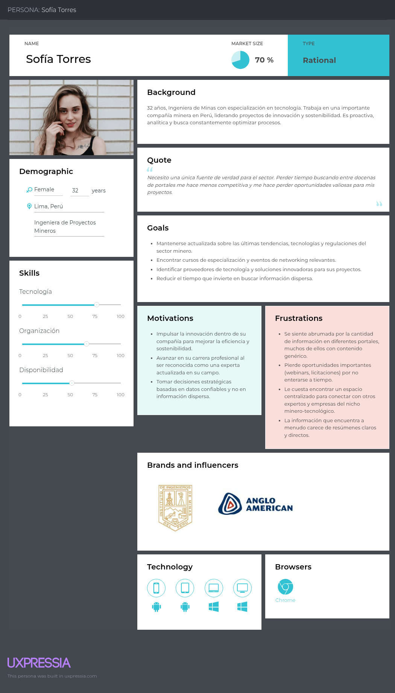

- **User Persona 2: Administradores de la Plataforma**

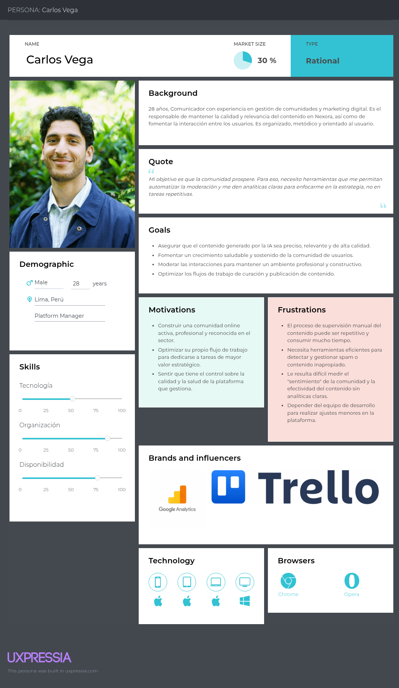

### 2.3.2. User Task Matrix

| Necesidad / Función | Importancia (Profesionales) | Frecuencia (Profesionales) | Importancia (Administradores) | Frecuencia (Administradores) |
|--------------------|----------------------------|---------------------------|-------------------------------|-----------------------------|
| Consultar noticias y tendencias del sector | Alta | Alta | - | - |
| Buscar cursos de capacitación o certificaciones | Media | Media | - | - |
| Encontrar eventos (webinars, congresos) | Media | Media | - | - |
| Buscar oportunidades laborales | Media | Alta | - | - |
| Publicar contenido o compartir una opinión | Baja | Baja | - | - |
| Conectar con otros profesionales o empresas | Media | Alta | - | - |
| Filtrar contenido por tema de interés específico | Alta | Media | - | - |
| Monitorear la calidad del contenido generado por IA | - | - | Alta | Alta |
| Moderar comentarios y publicaciones de usuarios | - | - | Alta | Alta |
| Gestionar reportes de usuarios (contenido/spam) | - | - | Media | Alta |
| Analizar métricas de engagement y actividad | - | - | Alta | Media |
| Publicar anuncios o contenido destacado | - | - | Media | Baja |
| Gestionar perfiles de empresas y proveedores | - | - | Media | Media |
| Colaborar con el equipo de soporte para resolver incidencias | - | - | Alta | Baja |

### 2.3.3. Empathy Mapping

- **Segmento 1: Profesionales Minero/Tecnológico**

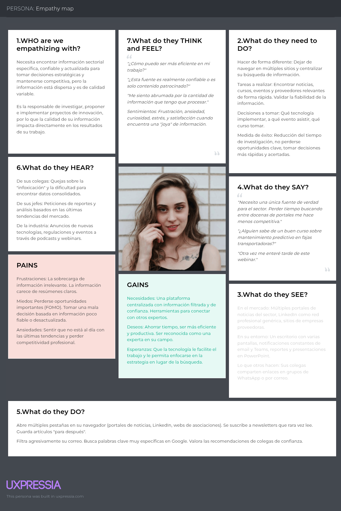

- **Segmento 2: Administradores de la Plataforma**

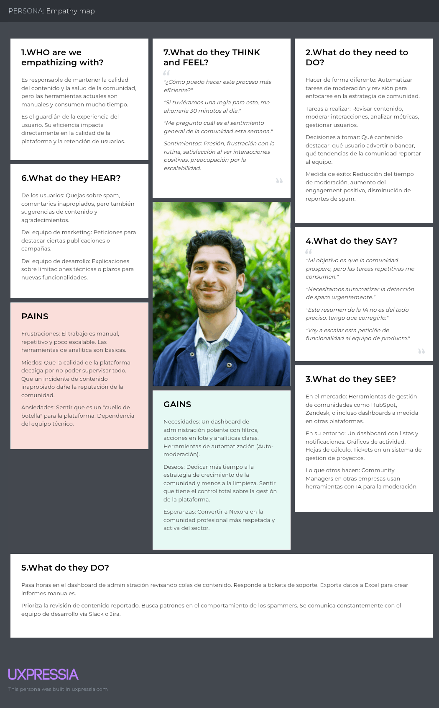

### 2.3.4. As-is Scenario Mapping
---

# Capítulo III: Requirements Specification

## 3.1. To-Be Scenario Mapping

El To-Be Scenario Mapping ayuda a visualizar cómo los profesionales del sector minero y tecnológico interactuarán con la plataforma Nexora en el futuro, destacando las fases de su experiencia, las acciones que realizan, lo que piensan y cómo se sienten en cada etapa.

# Escenario TO BE - Sofía Torres (Profesional Minero/Tecnológico)

- **Usuario:** Sofía Torres (Profesional Minero/Tecnológico)
- **Objetivo:** Preparar un reporte sobre nuevas tecnologías de automatización en minería.

| Fase | Búsqueda de Información | Filtrado y Selección | Consumo y Análisis | Creación y Uso |
|---|---|---|---|---|
| **Acciones (Doing)** | Inicia sesión en Nexora. Usa el buscador inteligente con palabras clave: "automatización minería 2024". La plataforma sugiere fuentes confiables y categorías relevantes. | Nexora muestra resultados pre-filtrados por relevancia, actualidad y confiabilidad. Sofía aplica filtros adicionales (ej: "solo artículos técnicos", "últimos 6 meses"). Guarda artículos en su biblioteca personal con un clic. | Lee resúmenes automáticos generados por IA de cada artículo. Explora gráficos de tendencias y datos comparativos extraídos por la plataforma. Consulta las fuentes originales con un enlace directo si lo necesita. | Usa la herramienta de exportación para descargar datos clave en CSV. Integra citas automáticas en su documento. Redacta el reporte con la ayuda de insights generados por IA (ej: "tendencias principales", "datos contrastados"). |
| **Pensamientos (Thinking)** | "¡Qué fácil es encontrar todo en un solo lugar!", "La IA ya descartó fuentes no confiables, eso ahorra tiempo". | "Los filtros son muy precisos, justo lo que necesito", "No tuve que leer titulares uno por uno". | "Los resúmenes son claros y me evitan leer documentos largos", "Los datos ya están organizados y contrastados". | "El reporte casi se escribe solo con la información ya estructurada", "Las citas automáticas son perfectas para mantener la rigurosidad". |
| **Sentimientos (Feeling)** | Alivio, curiosidad satisfecha. | Confianza, eficiencia. | Claridad, enfoque. | Satisfacción, productividad. |

---

# Escenario TO BE - Carlos Vega (Administrador de la Plataforma)

- **Usuario:** Carlos Vega (Administrador de la Plataforma)
- **Objetivo:** Asegurar la calidad del contenido y gestionar un reporte de spam.

| Fase | Monitoreo Diario | Detección de Incidencia | Investigación y Análisis | Acción y Resolución |
| :--- | :--- | :--- | :--- | :--- |
| **Acciones (Doing)** | Inicia sesión en el dashboard de administración. Revisa la cola de contenido generado por IA. Revisa las métricas de actividad del día anterior. | Recibe una notificación por correo sobre un reporte de usuario por "spam". Abre el enlace para ver la publicación reportada. | Revisa la publicación: es un comentario con un enlace sospechoso. Revisa el perfil del usuario que lo publicó y ve que tiene 10 comentarios idénticos en otras publicaciones. | Elimina los 10 comentarios. Banea al usuario infractor. Cierra el ticket de reporte del usuario. Vuelve a la cola de revisión de contenido. |
| **Pensamientos (Thinking)** | "Veamos qué generó la IA hoy", "El engagement subió un 5%, bien", "Espero que no haya problemas". | "Otro reporte de spam", "¿Será un falso positivo o un bot?". | "Claramente es un bot", "Tengo que eliminar todo esto manualmente, qué pérdida de tiempo", "¿Cuántos más habrá?". | "Listo, usuario baneado", "Deberíamos tener un sistema que detecte esto automáticamente", "Ahora a seguir con lo mío". |
| **Sentimientos (Feeling)** | Rutina, concentración. | Alerta, un poco de fastidio. | Frustración, tedio por la tarea repetitiva. | Alivio por haber resuelto el problema. Ligera impotencia por la falta de herramientas automáticas. |

## 2.4. Ubiquitous Language

Para asegurar una comunicación clara y consistente entre el equipo de desarrollo, los stakeholders y los usuarios, se establece el siguiente Lenguaje Ubicuo para el dominio de Nexora.

| Término | Definición |
| :--- | :--- |
| **Contenido Curado** | Información (noticias, cursos, eventos) que ha sido recopilada, filtrada y procesada por la IA de la plataforma para asegurar su relevancia y calidad. |
| **Resumen IA** | El texto conciso y claro generado automáticamente por la inteligencia artificial a partir de una fuente de contenido más extensa. |
| **Título Dinámico** | El titular atractivo y descriptivo generado por la IA para un contenido curado. |
| **Dashboard Personal** | La pantalla principal del usuario donde visualiza el flujo de contenido curado, filtrado según sus intereses y sector profesional. |
| **Alerta Inteligente** | Notificación proactiva y personalizada que recibe un usuario sobre una oportunidad o contenido de alto interés para él (ej. un nuevo curso, una oferta laboral). |
| **Networking** | El proceso de establecer y gestionar conexiones profesionales de valor a través de las herramientas de interacción de la plataforma. |
|---|---|---|---|---|
| **Acciones (Doing)** | Inicia sesión en el dashboard de administración. Revisa métricas de contenido generado por IA y engagement. El sistema ya ha pre-clasificado el contenido en "validado", "por revisar" y "potencial spam". | Recibe una alerta automática de detección de spam (no depende de reportes de usuarios). El sistema ya ha marcado 10 comentarios idénticos de un usuario y los ha ocultado automáticamente. | Carlos revisa el perfil del usuario y confirma la acción automática. El sistema proporciona un reporte de actividad sospechosa: patrones de comportamiento, IP, historial. | Carlos aprueba la acción automática con un clic. El sistema banea al usuario y elimina todo el contenido malicioso. Carlos recibe un resumen de la acción para su registro. |
| **Pensamientos (Thinking)** | "El dashboard me muestra todo claro, sin ruido", "La IA ya hizo el 80% del trabajo". | "Genial, el sistema detectó el spam antes que los usuarios", "No tuve que buscar manualmente". | "El reporte automático me da todo el contexto para decidir", "No pierdo tiempo investigando". | "Solo fue confirmar, todo resuelto en segundos", "Así debería ser siempre". |
| **Sentimientos (Feeling)** | Control, tranquilidad. | Prevención, eficacia. | Claridad, apoyo tecnológico. | Satisfacción, empowerment. |

## 3.2. User Stories

| Épicas | Título | Descripción |
|---|---|---|
| EPIC01 | Experiencia del Visitante en la Landing Page | Como visitante de la plataforma, quiero ver de manera clara y simple cómo la plataforma de IA puede ayudar a profesionales y empresas, con ejemplos, imágenes e información relevante, para entender su utilidad y beneficios. |
| EPIC02 | Gestión de Contenido Automatizado | Como usuario profesional, quiero que la plataforma automatice la curación, resumen y presentación de información relevante para mi industria, para ahorrar tiempo en la búsqueda de contenido de calidad. |
| EPIC03 | Funcionalidades Sociales y de Red | Como usuario, quiero interactuar con otros profesionales y empresas a través de perfiles, publicaciones, likes, comentarios y contacto directo, para establecer conexiones de valor en un entorno especializado. |
| EPIC04 | Gestión de Perfil y Preferencias | Como usuario, quiero personalizar mi perfil y preferencias para recibir contenido relevante específico de mi industria y intereses profesionales. |
| EPIC05 | Dashboard de Información y Analytics | Como usuario profesional, quiero visualizar y exportar datos e insights relevantes para analizar tendencias y oportunidades en mi sector. |
| EPIC06 | Sistema de Búsqueda y Filtrado Avanzado | Como usuario, quiero buscar y filtrar información de manera eficiente utilizando criterios específicos de industria, relevancia y actualidad. |
| EPIC07 | Gestión de Empresas y Proveedores | Como representante empresarial, quiero gestionar el perfil de mi empresa y conectar con profesionales y proveedores relevantes para mi sector. |
| EPIC08 | Sistema de Notificaciones y Alertas | Como usuario, quiero recibir notificaciones personalizadas sobre contenido, eventos y oportunidades relevantes para no perderme información importante. |

| ID | Título | Descripción | Criterios de Aceptación | Épica |
|---|---|---|---|---|
| US01 | Diseño informativo y atractivo | Como visitante, quiero una landing page clara y atractiva que explique los beneficios de la plataforma, con ejemplos e imágenes, para entender su utilidad. | **Escenario 1:** Dado que un visitante accede a la landing page, cuando la página carga completamente, entonces se muestra una interfaz organizada con secciones de beneficios, ejemplos e imágenes. **Escenario 2:** Dado que un visitante navega por la landing page, cuando explora las diferentes secciones, entonces el diseño es consistente, responsive y visualmente atractivo. | EPIC01 |
| US02 | Funcionalidad de botones Call-to-Action | Como visitante, quiero disponer de botones y enlaces estratégicos para acceder a más información, facilitando mi interacción con el producto. | **Escenario 1:** Dado que un visitante visualiza la landing page, cuando hace clic en botones del header, entonces es redirigido a la sección correspondiente sin errores. **Escenario 2:** Dado que un visitante llega al final de la página, cuando hace clic en "Registrarse", entonces el sistema muestra el formulario de registro. | EPIC01 |
| US03 | Sistema de curación automatizada | Como usuario, quiero que la plataforma automatically curate y resuma noticias relevantes para mi industria usando IA. | **Escenario 1:** Dado que un usuario configuró preferencias, cuando accede a su feed, entonces ve noticias relevantes curadas automáticamente. **Escenario 2:** Dado que hay nuevas publicaciones, cuando el sistema hace scraping, entonces procesa y categoriza correctamente el contenido. | EPIC02 |
| US04 | Generación automática de titulares | Como usuario, quiero que la plataforma genere automáticamente titulares atractivos para el contenido. | **Escenario 1:** Dado que el sistema procesa una noticia, cuando la presenta, entonces muestra un título generado que captura la esencia. **Escenario 2:** Dado que un contenido carece de imagen, cuando el sistema lo procesa, entonces genera una imagen relevante usando IA. | EPIC02 |
| US05 | Sistema de interacciones sociales | Como usuario, quiero poder interactuar con publicaciones mediante likes, comentarios y compartir. | **Escenario 1:** Dado que un usuario ve una publicación, cuando hace like, entonces el sistema registra la interacción y actualiza el contador. **Escenario 2:** Dado que un usuario comenta, cuando envía, entonces el sistema lo publica y notifica al creador. | EPIC03 |
| US06 | Sistema de mensajería directa | Como usuario, quiero contactar directamente con otros profesionales. | **Escenario 1:** Dado que un usuario quiere contactar, cuando accede a un perfil, entonces puede iniciar conversación privada. **Escenario 2:** Dado que llega un mensaje, cuando el usuario está online, entonces recibe notificación en tiempo real. | EPIC03 |
| US07 | Personalización de perfil | Como usuario, quiero personalizar mi perfil con información profesional. | **Escenario 1:** Dado que un usuario edita su perfil, cuando guarda cambios, entonces el sistema actualiza correctamente. **Escenario 2:** Dado que un perfil está completo, cuando otros lo ven, entonces muestra badge de "Perfil completo". | EPIC04 |
| US08 | Configuración de preferencias | Como usuario, quiero configurar preferencias para contenido relevante. | **Escenario 1:** Dado que usuario selecciona industrias, cuando guarda, entonces el feed muestra contenido de esas industrias. **Escenario 2:** Dado que usuario da feedback, cuando usa "interés/no interés", entonces el algoritmo se ajusta. | EPIC04 |
| US09 | Dashboard de analytics | Como usuario, quiero visualizar datos relevantes en dashboard intuitivo. | **Escenario 1:** Dado que usuario accede al dashboard, cuando carga, entonces muestra métricas relevantes. **Escenario 2:** Dado que usuario aplica filtros, cuando selecciona opciones, entonces el dashboard se actualiza. | EPIC05 |
| US10 | Exportación de datos | Como usuario, quiero exportar datos para análisis externo. | **Escenario 1:** Dado que usuario ve reporte, cuando exporta, entonces genera PDF con la información. **Escenario 2:** Dado que usuario necesita datos crudos, cuando exporta, entonces genera CSV con información. | EPIC05 |
| US11 | Búsqueda avanzada | Como usuario, quiero buscar contenido con filtros específicos. | **Escenario 1:** Dado que usuario usa búsqueda, cuando aplica filtros, entonces muestra resultados precisos. **Escenario 2:** Dado que usuario busca, cuando usa palabras clave, entonces sugiere términos relacionados. | EPIC06 |
| US12 | Gestión de empresa | Como empresa, quiero gestionar perfil y conectar con profesionales. | **Escenario 1:** Dado que empresa edita perfil, cuando actualiza información, entonces se refleja correctamente. **Escenario 2:** Dado que empresa busca profesionales, cuando usa filtros, entonces encuentra candidatos relevantes. | EPIC07 |
| US13 | Notificaciones personalizadas | Como usuario, quiero recibir alertas sobre contenido relevante. | **Escenario 1:** Dado que hay nuevo contenido, cuando coincide con preferencias, entonces envía notificación. **Escenario 2:** Dado que usuario configura alertas, cuando establece parámetros, entonces recibe notificaciones específicas. | EPIC08 |
| US14 | Sistema de eventos | Como usuario, quiero ver y registrar eventos de mi industria. | **Escenario 1:** Dado que hay nuevo evento, cuando es de mi industria, entonces aparece en mi feed. **Escenario 2:** Dado que me interesa evento, cuando me registro, entonces recibo recordatorios. | EPIC02 |
| US15 | Sistema de recomendaciones | Como usuario, quiero que me recomienden conexiones relevantes. | **Escenario 1:** Dado que mi perfil está completo, cuando uso plataforma, entonces sugiere conexiones relevantes. **Escenario 2:** Dado que interactúo con contenido, cuando el sistema analiza mis patrones, entonces mejora recomendaciones. | EPIC03 |
| TS01 | Rendimiento y tiempo de carga | Como usuario, quiero que la plataforma cargue rápidamente. | **Escenario 1:** Dado que usuario accede a página, cuando solicita contenido, entonces carga en menos de 3 segundos. **Escenario 2:** Dado que usuario con conexión limitada, cuando navega, entonces las imágenes se cargan optimizadas. | N/A |
| TS02 | Seguridad de datos | Como usuario, quiero que mi información esté protegida. | **Escenario 1:** Dado que hay intento de acceso no autorizado, cuando el sistema detecta, entonces bloquea y notifica. **Escenario 2:** Dado que usuario accede desde dispositivo nuevo, cuando inicia sesión, entonces requiere autenticación de dos factores. | N/A |
| TS03 | Escalabilidad | Como usuario, quiero que la plataforma esté siempre disponible. | **Escenario 1:** Dado que hay pico de tráfico, cuando muchos usuarios acceden, entonces la plataforma mantiene rendimiento. **Escenario 2:** Dado que se hace mantenimiento, cuando usuarios acceden, entonces ven página informativa. | N/A |
| TS04 | Compatibilidad multi-dispositivo | Como usuario, quiero acceder desde cualquier dispositivo. | **Escenario 1:** Dado que usuario accede desde mobile, cuando navega, entonces la interfaz se adapta correctamente. **Escenario 2:** Dado que usuario alterna devices, cuando inicia sesión, entonces su experiencia se sincroniza. | N/A |
| TS05 | Accesibilidad | Como usuario con discapacidad, quiero acceder a todos los contenidos. | **Escenario 1:** Dado que usuario usa lector de pantalla, cuando navega, entonces todo contenido es accesible. **Escenario 2:** Dado que usuario con limitación visual, cuando usa plataforma, entonces hay suficiente contraste y tamaño de texto. | N/A |
| TS06 | Privacidad de datos | Como usuario, quiero controlar mi información personal. | **Escenario 1:** Dado que usuario ajusta configuraciones de privacidad, cuando guarda cambios, entonces se aplican correctamente. **Escenario 2:** Dado que usuario solicita eliminar datos, cuando confirma, entonces toda su información se elimina completamente. | N/A |

## 3.3. Impact Mapping

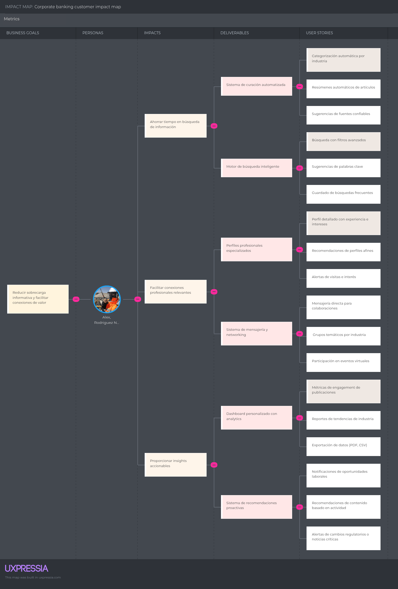

## 3.4. Product Backlog

| ID | User Story / Technical Story Id | Título | Descripción | Story Points (1/2/3/5/8) |
|---|---|---|---|---|
| 1 | US01 | Diseño informativo y atractivo | Como visitante, quiero una landing page clara y atractiva que explique los beneficios de la plataforma, con ejemplos e imágenes, para entender su utilidad y beneficios. | 3 |
| 2 | US02 | Funcionalidad de botones Call-to-Action | Como visitante, quiero disponer de botones y enlaces estratégicos para acceder a más información, facilitando mi interacción con el producto. | 2 |
| 3 | US03 | Sistema de curación automatizada de contenido | Como usuario profesional, quiero que la plataforma automatice la curación, resumen y presentación de información relevante para mi industria, para ahorrar tiempo en la búsqueda de contenido de calidad. | 8 |
| 4 | US04 | Generación automática de titulares e imágenes | Como usuario, quiero que la plataforma genere automáticamente titulares atractivos e imágenes relevantes para el contenido. | 5 |
| 5 | US05 | Sistema de interacciones sociales | Como usuario, quiero poder interactuar con publicaciones mediante likes, comentarios y compartir contenido. | 5 |
| 6 | US06 | Sistema de mensajería directa | Como usuario, quiero contactar directamente con otros profesionales y empresas a través de un sistema de mensajería. | 5 |
| 7 | US07 | Personalización de perfil profesional | Como usuario, quiero personalizar mi perfil con mi información profesional, experiencia e intereses. | 3 |
| 8 | US08 | Configuración de preferencias de contenido | Como usuario, quiero configurar mis preferencias para recibir contenido relevante de mis industrias de interés. | 3 |
| 9 | US09 | Dashboard de información y analytics | Como usuario profesional, quiero visualizar datos e insights relevantes para analizar tendencias y oportunidades en mi sector. | 8 |
| 10 | US10 | Exportación de datos e informes | Como usuario, quiero exportar datos e informes para análisis externo o presentaciones. | 2 |
| 11 | US11 | Sistema de búsqueda y filtrado avanzado | Como usuario, quiero buscar y filtrar información de manera eficiente utilizando criterios específicos de industria, relevancia y actualidad. | 5 |
| 12 | US12 | Gestión de empresas y proveedores | Como representante empresarial, quiero gestionar el perfil de mi empresa y conectar con profesionales y proveedores relevantes para mi sector. | 5 |
| 13 | US13 | Sistema de notificaciones y alertas | Como usuario, quiero recibir notificaciones personalizadas sobre contenido, eventos y oportunidades relevantes para no perderme información importante. | 3 |
| 14 | US14 | Sistema de eventos y webinars | Como usuario, quiero ver y registrar eventos de mi industria para mantenerme actualizado. | 3 |
| 15 | US15 | Sistema de recomendaciones inteligentes | Como usuario, quiero que me recomienden conexiones y contenido relevante basado en mi perfil y actividad. | 5 |
| 16 | TS01 | Rendimiento y tiempo de carga | Como usuario, quiero que la plataforma cargue rápidamente para una experiencia fluida. | 5 |
| 17 | TS02 | Seguridad y protección de datos | Como usuario, quiero que mi información personal y profesional esté segura y protegida. | 8 |
| 18 | TS03 | Escalabilidad y disponibilidad | Como usuario, quiero que la plataforma esté siempre disponible, incluso durante picos de tráfico. | 8 |
| 19 | TS04 | Compatibilidad multi-dispositivo | Como usuario, quiero acceder a la plataforma desde cualquier dispositivo con una experiencia consistente. | 5 |
| 20 | TS05 | Accesibilidad universal | Como usuario con discapacidad, quiero acceder a todos los contenidos de la plataforma. | 5 |
| 21 | TS06 | Privacidad de datos | Como usuario, quiero controlar mi información personal y tener transparencia sobre su uso. | 3 |

## 4.1.5. Quality Attribute Scenario Refinements.

## Scenario Refinement for Scenario 1

| Elemento               | Detalle                                                                                                                                     |
|-------------------------|---------------------------------------------------------------------------------------------------------------------------------------------|
| Scenario(s)             | Un profesional del sector accede al dashboard para consultar noticias filtradas por IA.                                                    |
| Business Goals          | Garantizar acceso ininterrumpido y ágil a contenido relevante; posicionar a Nexora como plataforma confiable.                              |
| Relevant Quality Attributes | Disponibilidad, Desempeño, Usabilidad                                                                                                   |
| Stimulus                | El usuario profesional solicita la carga del dashboard durante pico de tráfico.                                                            |
| Scenario Components     | Dashboard web, API backend, motor de filtrado de IA, base de datos                                                                         |
| Stimulus Source         | Usuario final (profesional minero/tecnológico)                                                                                             |
| Environment             | Plataforma en producción, horario laboral, alta concurrencia                                                                               |
| Artifact (if Known)     | Módulo de dashboard y endpoints "/feed" y "/dashboard" de la API                                                                           |
| Response                | El sistema responde mostrando el contenido filtrado correctamente en menos de 2 segundos.                                                  |
| Response Measure        | 95% de las peticiones entregan el contenido en menos de 2 segundos bajo carga estimada.                                                    |
| Questions               | ¿Los datos de feed se precargan o se generan on demand? ¿Existe cacheo de respuestas?                                                      |
| Issues                  | Riesgos por cuellos de botella en IA; necesidad de pruebas de stress y prototipado con caché.                                              |

---

## Scenario Refinement for Scenario 2

| Elemento               | Detalle                                                                                                                                     |
|-------------------------|---------------------------------------------------------------------------------------------------------------------------------------------|
| Scenario(s)             | Un usuario registra una preferencia de alerta para recibir notificaciones personalizadas.                                                  |
| Business Goals          | Mejorar la personalización y engagement, habilitar planes premium y retención de usuarios.                                                  |
| Relevant Quality Attributes | Personalización, Seguridad, Disponibilidad                                                                                               |
| Stimulus                | El usuario configura nuevas alertas y espera recibirlas según sus criterios preferidos.                                                    |
| Scenario Components     | Módulo gestión de alertas, backend de notificaciones, perfil de usuario, motor de IA de recomendaciones                                     |
| Stimulus Source         | Usuario profesional o administrador                                                                                                        |
| Environment             | Producción, conexión multi-dispositivo, cambios en reglas de preferencia                                                                  |
| Artifact (if Known)     | Endpoint "/alerts", configurador de interfaz, sistema de notificaciones push/email                                                         |
| Response                | El sistema actualiza y almacena configuración; dispara alertas únicamente ante nuevos eventos relevantes.                                   |
| Response Measure        | 100% de las preferencias se aplican correctamente y la entrega de alertas ocurre en menos de 10 minutos tras el evento.                     |
| Questions               | ¿Cómo se previene el envío de alertas irrelevantes? ¿Existe auditoría de cambios de configuración?                                          |
| Issues                  | Control de spam, gobierno sobre la privacidad de preferencias y robustez ante cambios masivos.                                             |

---

## Scenario Refinement for Scenario 3

| Elemento               | Detalle                                                                                                                                     |
|-------------------------|---------------------------------------------------------------------------------------------------------------------------------------------|
| Scenario(s)             | Un administrador debe eliminar usuarios que publican contenido de spam repetitivo.                                                         |
| Business Goals          | Proteger la reputación y seguridad de la comunidad, reducir cargas operativas manuales                                                      |
| Relevant Quality Attributes | Seguridad, Mantenibilidad, Usabilidad                                                                                                   |
| Stimulus                | Recepción de reporte de abuso o spam por parte de usuarios                                                                                 |
| Scenario Components     | Módulo de administración, backend de gestión de usuarios, servicio de moderación IA                                                         |
| Stimulus Source         | Administrador, otros usuarios (reportes)                                                                                                   |
| Environment             | Producción, dashboard administrativo                                                                                                       |
| Artifact (if Known)     | Panel de administración, endpoints "/admin/users", "/moderation"                                                                           |
| Response                | Sistema identifica usuario infractor, permite baneo inmediato y elimina publicaciones asociadas.                                           |
| Response Measure        | Procesos de eliminación y baneo ocurren en menos de 30 segundos desde acción administrativa.                                                |
| Questions               | ¿Los administradores cuentan con historial y auditoría de acciones? ¿Se pueden automatizar acciones para repetidos ofensores?               |
| Issues                  | Escalabilidad del sistema de reportes, integración de IA para moderación proactiva.                                                         |

## 4.2 Strategic-Level Domain-Driven Design.

Esta sección está dedicada a la aplicación del enfoque Domain-Driven Design (DDD) en la arquitectura de la solución Nexora. DDD permite modelar el dominio del negocio de manera colaborativa, segmentando y organizando tanto los procesos clave como los límites de responsabilidad dentro del sistema, para lograr una mayor claridad, modularidad y alineamiento con los objetivos del negocio. Aquí se documentará cómo Nexora estructura y organiza los distintos contextos de negocio, eventos, y flujos de información esenciales para satisfacer las necesidades identificadas en el análisis previo

## 4.2.1 EventStorming.

En el presente proyecto aplicamos la técnica de **EventStorming** con el fin de explorar y modelar el dominio de **Nexora**, una plataforma impulsada por IA para la curación de noticias y la interacción profesional.  
Este enfoque nos permitió identificar de manera colaborativa los eventos clave que ocurren en el sistema, así como los comandos, políticas y contextos que los rodean.

## Unstructured Exploration:
Es una técnica visual que reúne a los actores involucrados con el fin de analizar el dominio de un sistema. Se emplean notas adhesivas de varios colores para simbolizar diferentes componentes, lo que favorece el diálogo y la identificación de requisitos.

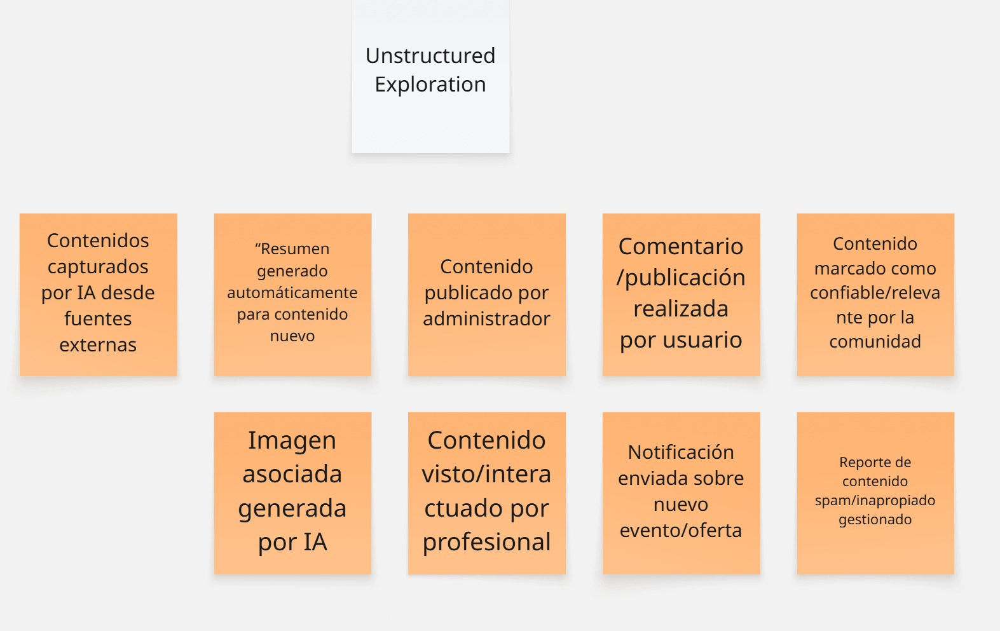

## Pain Points:
Se refieren a los retos o inconvenientes que experimentan los usuarios y demás interesados dentro del contexto del sistema. Reconocerlos permite establecer prioridades en las funcionalidades y diseñar soluciones que respondan de manera efectiva a las necesidades del usuario.
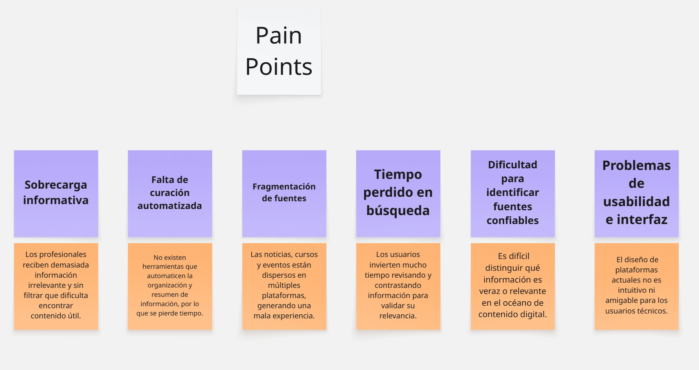

### Timeline
El **timeline** representa la secuencia de eventos clave que ocurren dentro de la plataforma Nexora, desde que un usuario accede al sistema hasta la moderación y análisis de métricas.  
Nos permitió visualizar el flujo completo de interacciones y detectar puntos críticos de carga, personalización de contenido y seguridad.

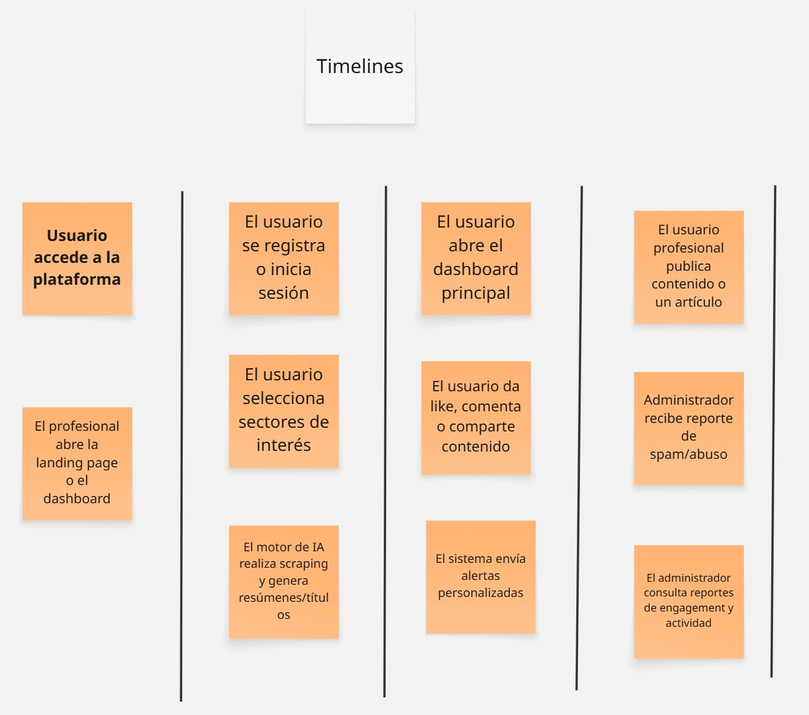

### Pivotal Points
Los **pivotal points** son los momentos decisivos dentro del flujo de eventos que pueden afectar significativamente la experiencia del usuario.  
En Nexora, se identificaron aspectos críticos como la carga del dashboard en menos de 3 segundos, la relevancia del contenido curado por IA, la entrega de notificaciones oportunas y la rápida moderación de contenido reportado.  

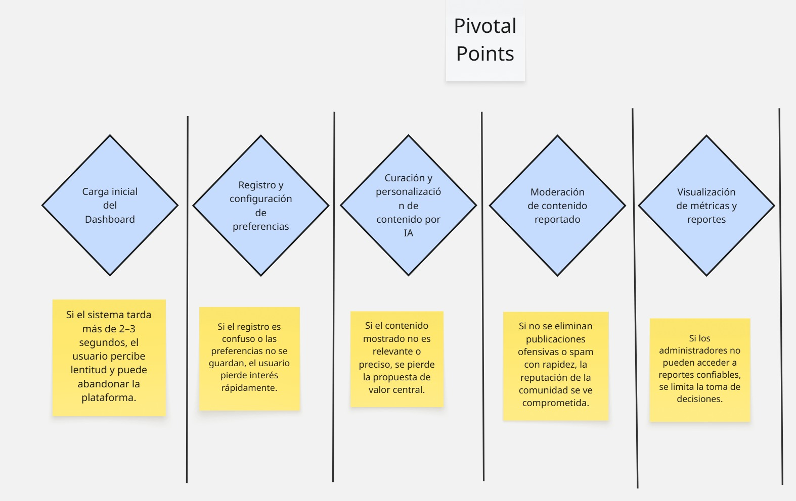

### Commands
Los **commands** son las acciones ejecutadas por los usuarios o el sistema que provocan un cambio en el estado de Nexora.  
Incluyen operaciones como registrar usuarios, configurar preferencias, solicitar el feed de noticias, publicar contenido, reaccionar con likes/comentarios y reportar publicaciones.  
Estos comandos definen cómo los actores interactúan con el sistema y disparan nuevos eventos.  

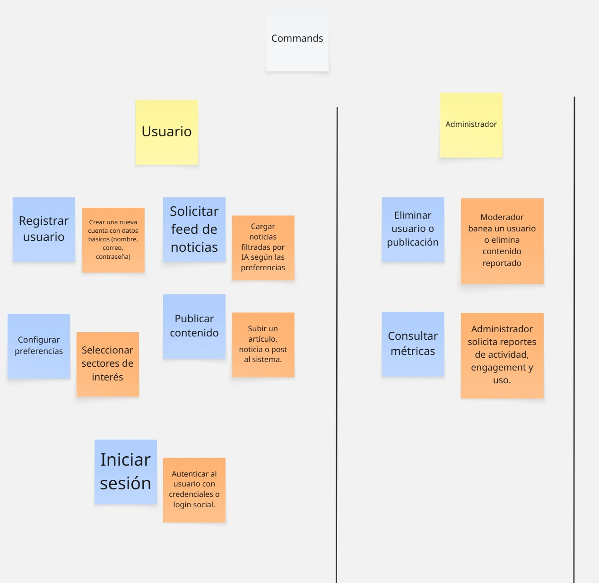

### Policies
Las **policies** son reglas de negocio que determinan cómo se deben manejar los comandos y eventos.  
En Nexora, destacan políticas de disponibilidad (tiempos de respuesta), relevancia del contenido curado, envío de notificaciones en menos de 10 minutos, moderación en menos de 30 segundos y auditoría de acciones administrativas.  

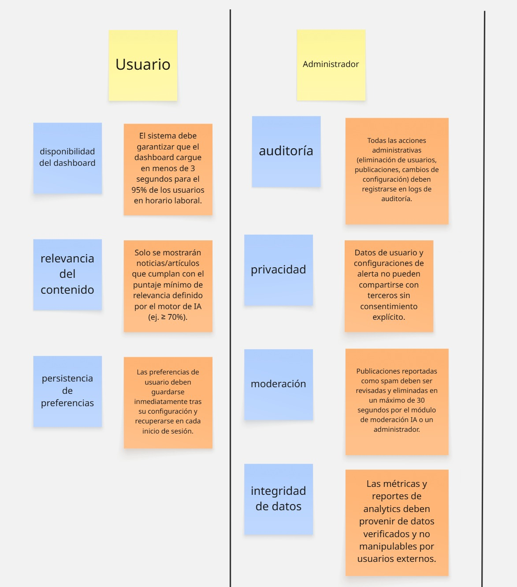

### Read Models
Los **read models** son representaciones optimizadas de la información para consulta rápida por parte de usuarios o administradores.  
En Nexora incluyen el feed personalizado de noticias, dashboards de usuario, historial de alertas, panel de interacciones, módulo de moderación, métricas de analytics y registros de auditoría.  

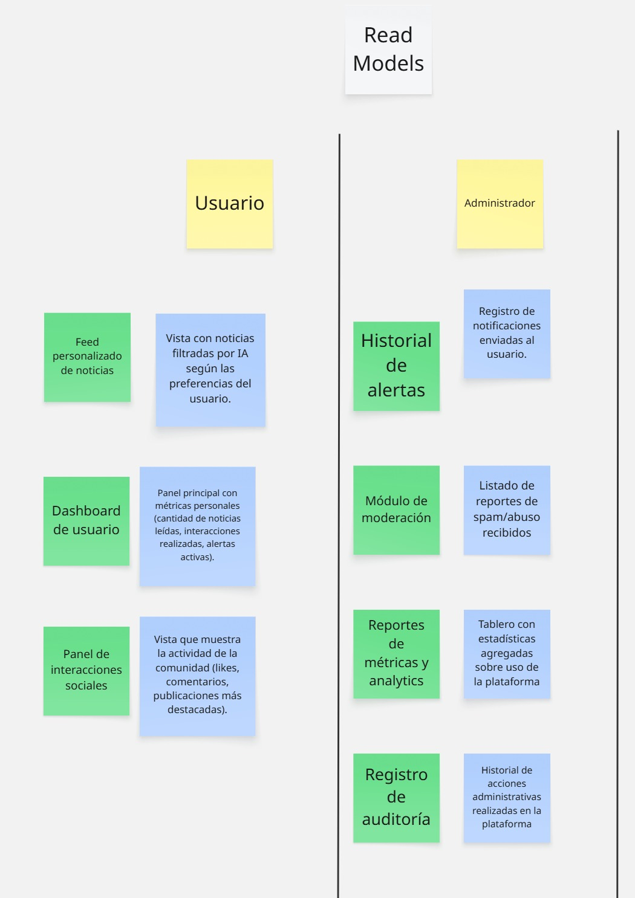

### External Systems
Los **external systems** corresponden a los servicios externos con los que Nexora se integra.  
Entre ellos están las APIs de noticias (Google News, Reuters), motores de IA para análisis semántico, servicios de notificaciones (Firebase, SendGrid), autenticación social (Google OAuth), almacenamiento en la nube y herramientas de analítica.  

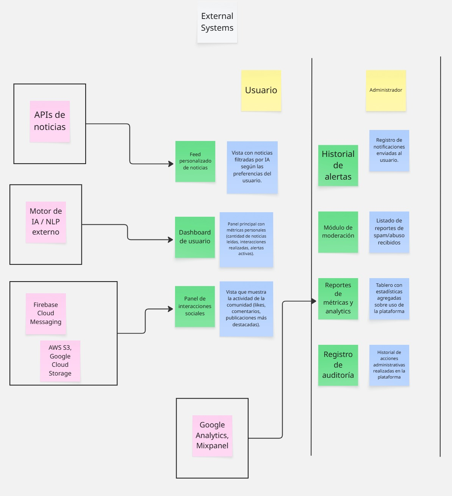

### Aggregates

Los **aggregates** (agregados) son unidades de consistencia en el dominio: agrupan entidades y reglas que deben mantenerse consistentes internamente. En el diseño orientado a dominio (DDD) cada aggregate tiene una **root entity** que actúa como punto de entrada para las operaciones y garantiza invariantes de negocio.  
A continuación se describen los aggregates principales propuestos para Nexora, sus atributos importantes, invariantes y los comandos/eventos claves que los afectan.

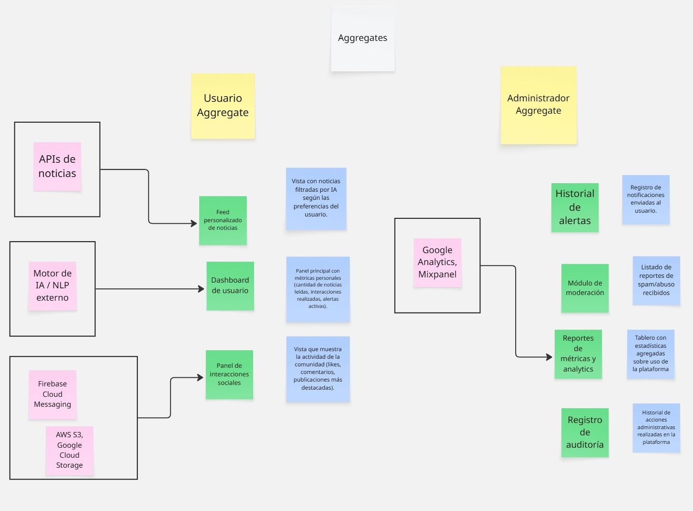

### Bounded Contexts
Los **bounded contexts** representan los límites dentro del dominio de Nexora donde se definen modelos y reglas específicas.  
Se definieron los contextos de:
- Curación y filtrado de contenido
- Moderación y seguridad
- Analítica y métricas

Cada contexto delimita responsabilidades y facilita la evolución de la arquitectura basada en microservicios.  

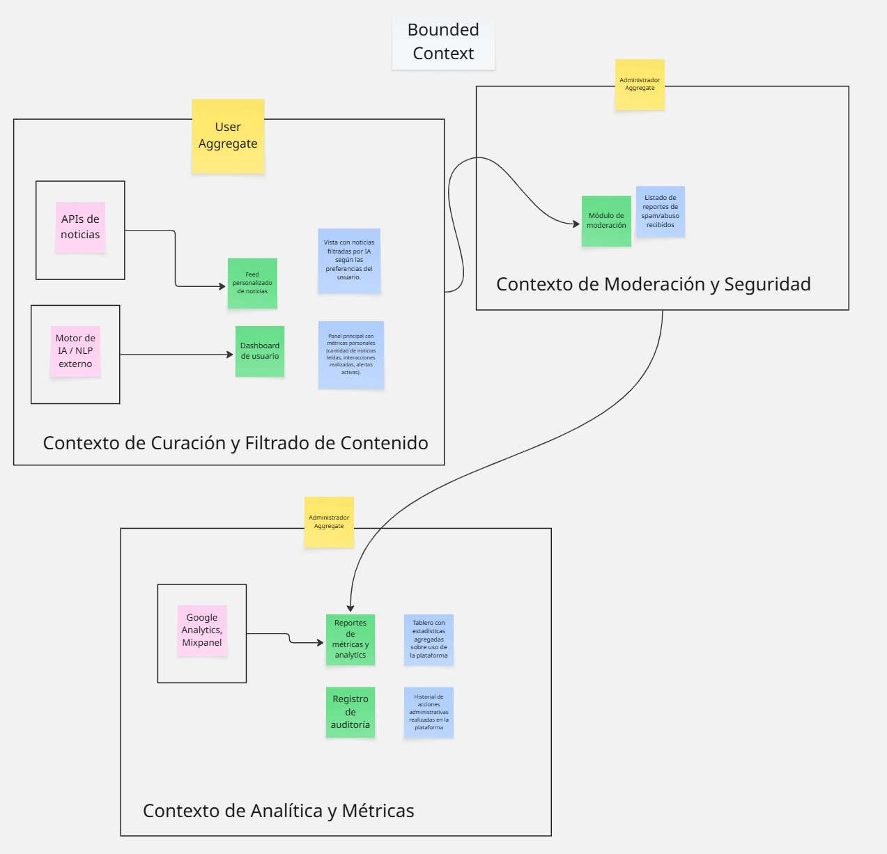

Link del Event Storming: https://miro.com/app/board/uXjVJGsUvTY=/?share_link_id=473714074415

## 4.2.2. Candidate Context Discovery

Durante esta etapa se realizó la identificación de los **contextos candidatos** dentro del dominio de Nexora, con el propósito de separar responsabilidades y evitar ambigüedades en el modelo.  
El análisis se llevó a cabo en base a los eventos principales, los comandos y las políticas identificadas en las sesiones de EventStorming.

De este trabajo surgieron los siguientes contextos candidatos:

- **Curación y Filtrado de Contenido**: abarca la recolección de noticias desde fuentes externas, análisis con IA y generación de un feed personalizado.
- **Moderación y Seguridad**: procesa reportes, gestiona sanciones y mantiene la confianza en la comunidad.
- **Analítica y Métricas**: concentra la generación de reportes, métricas de uso y paneles de visualización.  

### Contexto de Curación y Filtrado de Contenido

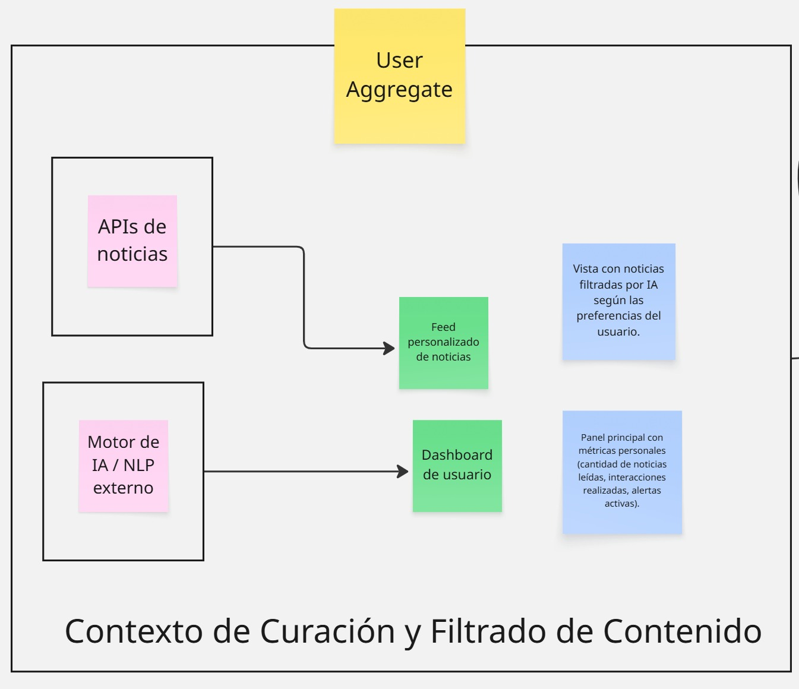

### Contexto de Moderacion

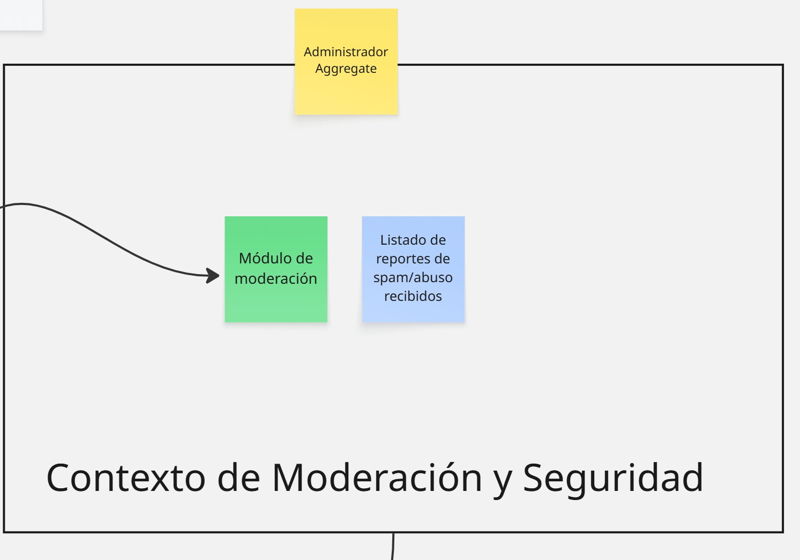

### Contexto de Analítica y Métricas

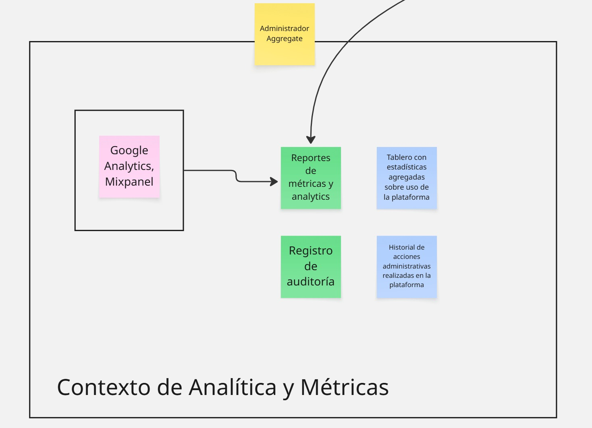

## 4.2.3. Domain Message Flows Modeling.

## 4.2.4. Bounded Context Canvases.

## 4.2.5. Context Mapping

Una vez identificados los **bounded contexts** de Nexora, se procedió a realizar el **context mapping**, con el fin de representar gráficamente y describir las relaciones de dependencia e interacción entre ellos.  
Este mapeo permite comprender cómo se comunican los subdominios y cuáles son las responsabilidades compartidas o los puntos de integración.

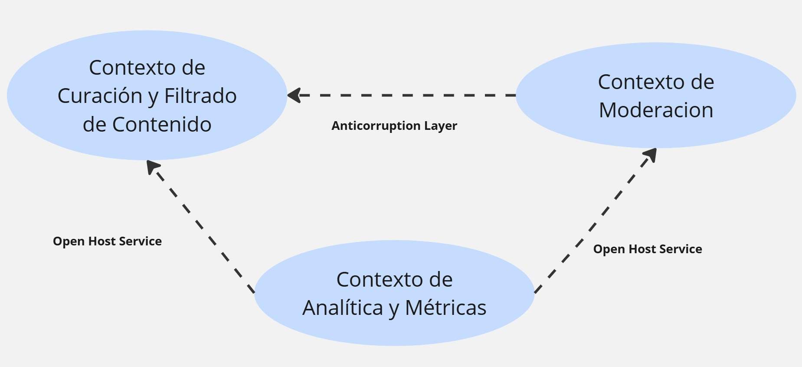

## 4.3. Software Architecture. 

| ID | Título | Descripción | Escenarios de aceptación | Relacionado con Epic |
|----|--------|-------------|------------------------|--------------------|
| CON-01 | Compatibilidad Multiplataforma | La solución debe ser compatible con los sistemas operativos Windows, MacOS, Linux, Android e iOS, garantizando que los productos digitales puedan ejecutarse adecuadamente en dichos entornos. | Escenario 1: Redirección desde Landing Page Dado que el usuario interactúa desde cualquier dispositivo, cuando hace clic en “Empezar ahora” u otro call-to-action, entonces la aplicación lo redirige correctamente a la versión correspondiente (web / móvil) sin pérdida de funcionalidad. Escenario 2: Consistencia de datos Dado que un usuario actualiza su perfil desde la app móvil, cuando accede posteriormente desde la app web, entonces ve reflejados los cambios de forma consistente. | EPIC01, EPIC04 |
| CON-02 | Arquitectura Monolítica Modular | La primera versión de la aplicación debe implementarse bajo un modelo monolítico modular para simplificar la implementación inicial y reducir costos de infraestructura, manteniendo una separación interna de responsabilidades. | Escenario 1: Estructura del proyecto Dado que el equipo de desarrollo inicia el backend, cuando se analiza la estructura del código, entonces se observa una separación clara en módulos como usuarios, autenticación y contenidos dentro de un único despliegue. Escenario 2: Despliegue Dado que se despliega la aplicación en un entorno de pruebas, cuando se ejecuta el backend, entonces todos los módulos están presentes y operativos dentro de una única unidad de despliegue. | EPIC02, EPIC03, EPIC04, EPIC05, EPIC06, EPIC07 |
| CON-03 | Tecnologías Definidas | Se utilizarán Ruby on Rails y PostgreSQL para el backend, y TailwindCSS para el frontend, siguiendo los lineamientos técnicos internos del cliente. | Escenario 1: Desarrollo de módulos Dado que se implementa una nueva funcionalidad, cuando se revisa el stack tecnológico, entonces se confirma que está desarrollado con Ruby on Rails, PostgreSQL y TailwindCSS. | EPIC02, EPIC05, EPIC06 |
| CON-04 | Cumplimiento Normativo | El sistema debe cumplir con la Ley de Protección de Datos Personales (Perú) y GDPR para el manejo de datos. | Escenario 1: Consentimiento y eliminación Dado que un usuario entrega sus datos personales, cuando solicita su eliminación, entonces el sistema elimina dichos datos y no los procesa sin consentimiento previo. | EPIC04, EPIC08 |
| CON-05 | Presupuesto y Plazos | El desarrollo debe ajustarse al presupuesto asignado y tener lista la versión MVP en un plazo máximo de 3 meses. | Escenario 1: Control de avance Dado que se revisa el avance del proyecto, cuando se realizan revisiones quincenales, entonces se confirma que se avanza dentro del presupuesto y cronograma definidos. | EPIC01, EPIC02, EPIC03, EPIC04, EPIC05, EPIC06, EPIC07, EPIC08 |
| CON-06 | Landing Page Estática | Se debe desarrollar una página de aterrizaje estática utilizando HTML, CSS y opcionalmente JavaScript para explicar el modelo de negocio y redirigir usuarios a las respectivas aplicaciones. | Escenario 1: Acceso al Landing Dado que un usuario accede a la URL de la landing page, cuando se carga el contenido, entonces se muestran elementos informativos, visuales y enlaces funcionales. Escenario 2: Redirección Dado que el usuario hace clic en un call-to-action de la landing, cuando se redirige a la web app o sitio de descarga, entonces llega al destino correspondiente según su plataforma o perfil. | EPIC01 |
| CON-07 | Repositorio en GitHub | El código fuente del proyecto debe estar versionado y publicado en un repositorio en GitHub con estructura organizada, control de versiones y colaboración en equipo. | Escenario 1: Revisión del repositorio Dado que se accede al repositorio del equipo en GitHub, cuando se inspeccionan los archivos, entonces se encuentra una estructura clara con carpetas por producto, documentación y código fuente. Escenario 2: Control de versiones Dado que se inspecciona el historial de commits, cuando se revisan las ramas y mensajes, entonces se observa un uso adecuado de buenas prácticas como Gitflow o commits semánticos. | EPIC02, EPIC03, EPIC04, EPIC05, EPIC06, EPIC07 |

## 4.1.3 Architectural Drivers Backlog

En esta sección se establece el conjunto de Architectural Drivers acordados por el equipo, resultado del proceso iterativo llevado a cabo durante el Quality Attribute Workshop. El backlog incluye Functional Drivers, Quality Attribute Drivers y Constraints. Se priorizan primero aquellos de alta importancia para los Stakeholders y alto impacto en la arquitectura y complejidad técnica.

| Driver ID | Título | Descripción | Importancia | Architecture & Technical Complexity |
|-----------|--------|------------|------------|-----------------------------------|
| DR-01 | Rendimiento | El sistema debe entregar contenido personalizado en tiempo real, procesando múltiples solicitudes simultáneas sin retrasos perceptibles, asegurando experiencia óptima para los usuarios profesionales. | High | High |
| DR-02 | Escalabilidad | La plataforma debe soportar un aumento significativo de usuarios y volumen de datos (picos de +50% en un mes) sin degradar velocidad, estabilidad o disponibilidad de servicios críticos. | High | High |
| DR-03 | Disponibilidad | Garantizar acceso continuo al sistema incluso durante fallos parciales o mantenimiento, asegurando operación de funciones críticas como registro de usuarios, contenido curado y sincronización de datos. | High | High |
| DR-04 | Seguridad | Proteger información y credenciales mediante cifrado, autenticación multifactor, control de acceso por roles (RBAC) y cumplimiento de normativas de privacidad (GDPR y Ley de Protección de Datos de Perú). | High | High |
| DR-05 | Usabilidad | Ofrecer interfaz clara e intuitiva con guías de onboarding, facilitando el aprendizaje y uso eficiente de funciones principales, reduciendo la necesidad de asistencia externa. | Medium | Medium |
| DR-06 | Mantenibilidad | Permitir actualizaciones y despliegues rápidos con mínima interrupción, incluyendo rollback seguro ante errores, garantizando evolución del sistema sin deuda técnica significativa. | Medium | Medium |
| DR-07 | Compatibilidad | Mantener funcionalidad y experiencia de usuario consistente en múltiples dispositivos y navegadores (iOS, Android, Windows, MacOS, Linux). | Medium | Medium |
| DR-08 | Integración | Permitir conexión con otros sistemas y herramientas externas (APIs, CRM), garantizando interoperabilidad y facilidad de intercambio de datos. | Medium | Medium |

# 4.1.4 Architectural Design Decisions

En esta sección se documenta el proceso de decisión arquitectónica siguiendo los stages del Quality Attribute Workshop. Para cada iteración se listan los drivers considerados, los patrones evaluados y los criterios para la selección final. Se muestran hasta 3 patrones candidatos por driver, con sus pros y contras dentro de cada patrón.

| Driver ID | Título de Driver | Pattern 1 | Pattern 2 | Pattern 3 |
|-----------|-----------------|-----------|-----------|-----------|
| DR-01 | Rendimiento | **Caching de resultados** **Pro:** Reduce tiempo de respuesta y mejora la experiencia del usuario. **Con:** Complejidad adicional en invalidación de caché. | **Load Balancer con distribución de carga** **Pro:** Mejora disponibilidad y balancea solicitudes. **Con:** Requiere infraestructura adicional y monitoreo constante. | **CDN para contenido estático** **Pro:** Optimiza entrega global de contenido. **Con:** No mejora operaciones dinámicas ni transacciones en tiempo real. |
| DR-02 | Escalabilidad | **Microservicios** **Pro:** Escala horizontalmente cada servicio de forma independiente. **Con:** Mayor complejidad operativa y overhead de red. | **Monolito modular** **Pro:** Despliegue rápido y simple en la fase inicial. **Con:** Difícil de escalar por componente a gran escala. | **Serverless** **Pro:** Escalado automático y pago por uso según demanda. **Con:** Limitaciones de ejecución, cold starts y dependencias del proveedor. |
| DR-03 | Disponibilidad | **Replicación de base de datos** **Pro:** Mantiene datos accesibles ante fallos. **Con:** Requiere sincronización constante y gestión de conflictos. | **Clúster de servidores** **Pro:** Redundancia y failover rápido. **Con:** Mayor costo de infraestructura y administración. | **Contenedores con orquestación (K8s)** **Pro:** Recuperación automática de servicios y resiliencia. **Con:** Curva de aprendizaje elevada y mantenimiento complejo. |
| DR-04 | Seguridad | **Autenticación multifactor (2FA)** **Pro:** Aumenta la protección de cuentas. **Con:** Puede afectar la experiencia del usuario si no se implementa adecuadamente. | **OAuth2 + JWT** **Pro:** Seguridad estándar de la industria y escalable. **Con:** Requiere gestión robusta de tokens y expiraciones. | **Validación en backend** **Pro:** Permite lógica flexible y control centralizado. **Con:** Si el backend es comprometido, la seguridad se ve afectada. |
| DR-05 | Usabilidad | **Onboarding guiado** **Pro:** Facilita el aprendizaje de la plataforma. **Con:** Requiere diseño cuidadoso para evitar que sea tedioso. | **Interfaz drag & drop** **Pro:** Experiencia rápida e intuitiva. **Con:** Desarrollo frontend más complejo y mayor esfuerzo de validación. | **Historial con trazabilidad directa** **Pro:** Transparencia y verificación de acciones. **Con:** Puede ser técnico y complejo para usuarios sin experiencia. |
| DR-06 | Mantenibilidad | **Despliegue continuo con rollback automático** **Pro:** Permite actualizaciones seguras y rápidas. **Con:** Requiere configuración avanzada de CI/CD. | **Modularización de código** **Pro:** Facilita cambios aislados y refactorizaciones seguras. **Con:** Refactorización inicial costosa. | **Documentación y pruebas automatizadas** **Pro:** Reduce errores durante actualizaciones. **Con:** Mantener documentación y pruebas actualizadas es laborioso. |
| DR-07 | Compatibilidad | **Testing automatizado en múltiples navegadores y dispositivos** **Pro:** Garantiza funcionamiento consistente. **Con:** Costoso mantener suites de pruebas amplias. | **Uso de frameworks cross-platform** **Pro:** Reduce duplicación de código y esfuerzo de mantenimiento. **Con:** Limitaciones en funcionalidades nativas. | **Contenedores para entornos reproducibles** **Pro:** Asegura consistencia de entornos de desarrollo y producción. **Con:** Añade complejidad de infraestructura y mantenimiento. |
| DR-08 | Integración | **APIs REST estandarizadas** **Pro:** Facilita conexión con otros sistemas y servicios. **Con:** Dependencias externas y potenciales problemas de compatibilidad. | **Middleware de integración** **Pro:** Orquesta datos y facilita interoperabilidad entre sistemas. **Con:** Añade capa de complejidad y mantenimiento. | **Webhooks y eventos en tiempo real** **Pro:** Actualización inmediata de información y sincronización. **Con:** Requiere monitoreo constante y manejo de errores robusto. |

# 4.3.1. Software Architecture System Landscape Diagram.

# 4.3.2. Software Architecture Context Level Diagrams.

En el diagrama de contexto se observa que el Mining/Tech Professional y el Platform Administrator interactúan con Nexora, utilizando la aplicación web y la aplicación móvil. Nexora, a su vez, se conecta con sistemas externos como Google News, Reuters, Firebase, SendGrid y Google Gmail para obtener noticias, enviar notificaciones y gestionar la autenticación.

# 4.3.3. Software Architecture Container Level Diagrams.

En el diagrama de contenedores se distinguen los principales componentes internos: la Web App, Mobile App, el REST API Gateway que centraliza las peticiones y la Base de Datos que almacena usuarios, contenidos y permisos.

# 4.3.4. Software Architecture Deployment Diagrams.

En el diagrama de despliegue se aprecia que la aplicación web corre en navegadores de escritorio o móviles, la aplicación móvil en dispositivos Android/iOS, y ambos se comunican con el REST API, el cual a su vez accede al clúster de base de datos para persistir la información.

