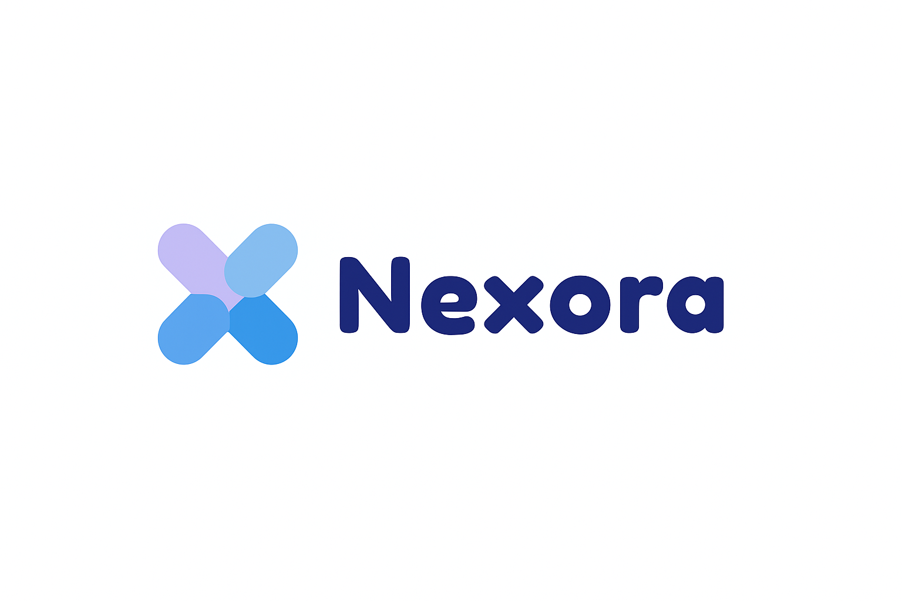
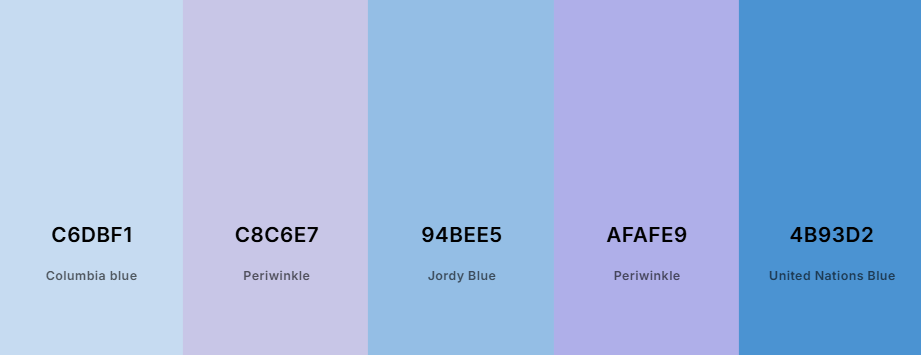
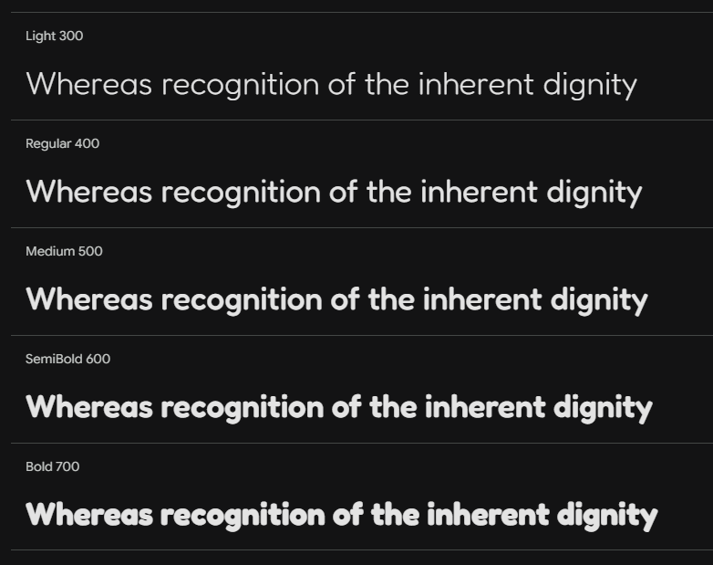

# Capítulo VI: Solution UX Design. 
## 6.1. Style Guidelines. 
### 6.1.1. General Style Guidelines. 

El diseño de la interfaz se basa en una estética moderna, amigable y tecnológica, transmitiendo innovación y confianza en los softwares emergentes. La paleta de colores elegida combina tonalidades de azul y lila, que evocan tecnología, profesionalismo y creatividad, manteniendo una sensación fresca y accesible para los usuarios.

La tipografía principal utilizada es Fredoka, seleccionada por su estilo redondeado, moderno y legible, lo que refuerza la experiencia amigable y cercana al usuario. Esta fuente permite diferenciar claramente entre títulos, subtítulos y cuerpo de texto mediante variaciones en peso y tamaño, garantizando jerarquía visual y facilidad de lectura.

El logo de Nexora refleja la identidad visual del proyecto, transmitiendo innovación, simplicidad y confianza a través de un isotipo geométrico que evoca conexión y movimiento, junto a una tipografía sans serif moderna que garantiza legibilidad y minimalismo. Sus colores principales en gamas de azul transmiten frescura, tecnología y profesionalismo, mientras que el uso de variantes (a color, monocromática e invertida) asegura su correcta adaptación a distintos medios digitales y físicos. El diseño mantiene proporciones limpias, con un área de seguridad definida, evitando deformaciones, cambios de color o efectos que alteren su esencia.

El estilo general busca un equilibrio entre simplicidad y modernidad, con una interfaz limpia, clara y adaptable tanto para usuarios expertos como para quienes tienen un primer acercamiento a la tecnología.

### 6.1.2. Web, Mobile & Devices Style Guidelines. 

**Diseño Web**

La versión web de Nexora se ha diseñado siguiendo un enfoque grid responsivo, garantizando que los elementos se adapten a diferentes resoluciones de pantalla sin perder legibilidad ni coherencia visual. Los menús principales se ubican en la parte superior para facilitar la navegación, mientras que los botones de acción cuentan con colores contrastantes de la paleta (United Nations Blue para acciones primarias y Columbia Blue para secundarias). Las transiciones suaves y los estados hover aportan dinamismo y una experiencia más intuitiva.

**Diseño Móvil**

La plataforma en su versión móvil está construida bajo el principio de mobile-first, priorizando la simplicidad y rapidez en la interacción. Los menús se presentan en formato desplegable (hamburguesa) y los elementos clave, como botones de publicación o notificaciones, se sitúan en zonas de fácil acceso para el pulgar. Se utilizan íconos grandes y claros para reducir la carga visual y mejorar la navegación en pantallas reducidas. Además, la jerarquía tipográfica con Fredoka se mantiene, ajustando los tamaños según el dispositivo para conservar legibilidad.

En conjunto, estas directrices garantizan que Nexora ofrezca una experiencia coherente, moderna y accesible en cualquier dispositivo, reforzando su identidad como un software emergente impulsado por innovación tecnológica.

**Paleta de colores**

**Fuente**

## 6.2. Information Architecture. 
### 6.2.1. Organization Systems 

**Jerarquía Visual**

Nexora ha sido diseñada con una jerarquía visual clara que potencia la experiencia de los profesionales y empresas dentro de la plataforma. Los elementos principales, como botones de acción, accesos directos y secciones de publicación, se encuentran ubicados de forma prominente en la interfaz. El uso de diferentes tonalidades de la paleta azul (Columbia Blue, Jordy Blue y United Nations Blue) permite diferenciar acciones primarias, secundarias y complementarias, logrando que el usuario identifique con facilidad el flujo de interacción en cada sección de la aplicación.

**Jerarquía Tipográfica**

La fuente seleccionada para Nexora es Fredoka, elegida por su diseño moderno, amigable y altamente legible. Los títulos y subtítulos se presentan en un peso y tamaño mayor, facilitando la identificación inmediata de las secciones clave, mientras que el contenido principal y los textos secundarios mantienen un estilo uniforme y balanceado. Esta jerarquía tipográfica permite que los usuarios se orienten rápidamente dentro de la interfaz, asegurando coherencia y claridad en todo momento.

**Alineación**

El contenido principal se encuentra alineado a la izquierda para favorecer la lectura y la rápida interacción, mientras que en dispositivos móviles se prioriza la alineación central de los elementos clave, optimizando la navegación en pantallas reducidas. Los botones mantienen un texto centrado y bordes redondeados, lo que refuerza la estética moderna y tecnológica de la plataforma.

**Color y Contraste**

La paleta cromática de Nexora está basada en tonos azules que evocan confianza, innovación y profesionalismo. Columbia Blue y Periwinkle son utilizados como colores de fondo y secciones secundarias, aportando suavidad y limpieza visual, mientras que United Nations Blue se reserva para los botones de acción principal, asegurando un contraste claro que dirige la atención del usuario hacia las funciones más relevantes. Este sistema de contraste asegura una experiencia intuitiva y moderna, alineada con la visión de software emergente de la plataforma.

**Botones e Íconos**

Los botones han sido diseñados con un estilo minimalista, bordes suaves y colores brillantes de la paleta, facilitando su identificación inmediata. Los íconos, inspirados en un estilo lineal y moderno, representan funcionalidades clave como notificaciones, interacciones sociales, búsqueda y perfil de usuario. Esto permite que los profesionales y empresas identifiquen de manera instantánea las acciones disponibles, reduciendo la curva de aprendizaje y reforzando la idea de un ecosistema digital eficiente.

### 6.2.2. Labeling Systems.

**Lenguaje Claro y Consistente**

El sistema de etiquetado de Nexora se ha diseñado con el objetivo de mantener una comunicación clara, directa y fácil de comprender. Se evita el uso de tecnicismos complejos y se prioriza un lenguaje cercano y profesional, de modo que tanto usuarios corporativos como profesionales independientes puedan navegar sin dificultad dentro de la plataforma.

**Coherencia en Terminología**

Todas las etiquetas mantienen un estilo uniforme en cuanto a estructura y tono. Se emplean palabras cortas y familiares, acompañadas de verbos de acción cuando se trata de botones o enlaces. Esto asegura que las funcionalidades se comprendan de manera inmediata, reduciendo posibles ambigüedades en la interacción.

**Tipografía y Estilo Visual**

Las etiquetas utilizan la tipografía Fredoka, que aporta modernidad y legibilidad. Los títulos y nombres de secciones se muestran en un peso de fuente mayor para reforzar su importancia jerárquica, mientras que las etiquetas secundarias emplean un peso medio que mantiene equilibrio en la lectura. Para botones primarios, se combina la tipografía con colores de alto contraste (ej. texto blanco sobre United Nations Blue), garantizando visibilidad inmediata.

**Colores y Contraste en Etiquetas**

- Acciones primarias (ejemplo: “Publicar”, “Conectar”): texto blanco sobre botones United Nations Blue (#4B93D2).

- Acciones secundarias (ejemplo: “Guardar borrador”, “Explorar más”): texto en Columbia Blue (#C6DBF1) sobre fondos neutros.

- Secciones informativas (ejemplo: “Noticias”, “Tendencias”): texto en Periwinkle (#C8C6E7) para diferenciarlo del contenido funcional.

**Ejemplos de Etiquetas en Nexora**

- Menú principal: Inicio, Noticias, Publicaciones, Conexiones, Mensajes, Configuración.

- Botones de acción: Publicar, Conectar, Guardar, Compartir, Contactar.

- Funciones sociales: Me gusta, Comentar, Compartir.

- Mensajes del sistema: “Cambios guardados correctamente”, “Error en la conexión, inténtalo de nuevo”.
